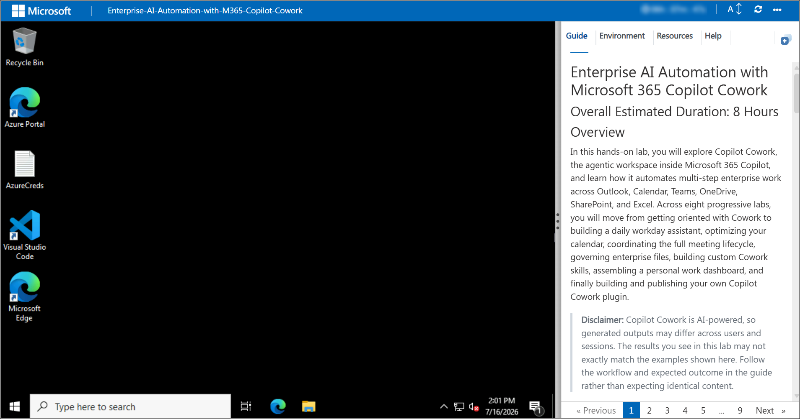
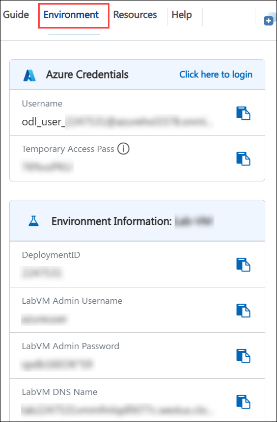

# Enterprise AI Automation with Microsoft 365 Copilot Cowork

## Overall Estimated Duration: 8 Hours

## Overview

In this hands-on lab, you will explore Copilot Cowork, the agentic workspace inside Microsoft 365 Copilot, and learn how it automates multi-step enterprise work across Outlook, Calendar, Teams, OneDrive, SharePoint, and Excel. Across eight progressive labs, you will move from getting oriented with Cowork to building a daily workday assistant, optimizing your calendar, coordinating the full meeting lifecycle, governing enterprise files, building custom Cowork skills, assembling a personal work dashboard, and finally building and publishing your own Copilot Cowork plugin.

>**Disclaimer:** Copilot Cowork is AI-powered, so generated outputs may differ across users and sessions. The results you see in this lab may not exactly match the examples shown here. Follow the workflow and expected outcome in the guide rather than expecting identical content.

## Objectives

In this lab, you will perform the following:

- Get oriented with Copilot Cowork, seed your Outlook, OneDrive, and Teams environment, and run your first agentic tasks
- Build a personalized daily workday assistant that briefs you from your calendar, inbox, and Teams activity
- Detect and resolve calendar conflicts, apply executive-style standing rules, and automate an out-of-office vacation handoff
- Automate the full lifecycle of an executive meeting — AI-generated preparation, cross-app content collection, and grounded post-meeting follow-up
- Classify, rename, and govern a shared OneDrive environment with human-in-the-loop approval gates
- Design and build custom, reusable Cowork skills using the conversational Skill Builder
- Build and schedule a self-refreshing personal work dashboard powered by Microsoft Graph data
- Build, validate, and publish a custom Copilot Cowork plugin connected to an external data source through the Model Context Protocol (MCP)

## Pre-requisites

Participants should have:

- Access to Microsoft 365 Copilot with Copilot Cowork enabled
- A Microsoft account with permissions to use Outlook, Calendar, Teams, OneDrive, SharePoint, Word, Excel, and Microsoft To Do
- Access to the Microsoft 365 Admin Center, with permissions to upload, deploy, and assign a custom app (required for the plugin-publishing lab)
- Access to the provisioned lab virtual machine and its local file system, for downloading and uploading generated files such as skill definitions and plugin packages
- Basic familiarity with Microsoft 365 applications and everyday business scenarios

## Getting Started with the Lab

Welcome to the Enterprise AI Automation with Microsoft 365 Copilot Cowork workshop. In this workshop, you will explore how Copilot Cowork enhances productivity by planning and executing multi-step tasks on your behalf directly within Microsoft 365. Through a series of guided labs, you will learn how to triage email and calendars, coordinate meetings, govern files, build custom skills, assemble dashboards, and extend Cowork with your own plugins.

This workshop provides a hands-on experience with modern agentic AI workflows, helping you understand how Copilot Cowork can transform everyday enterprise tasks and improve productivity across the Microsoft 365 ecosystem.

## Lab Guide Zoom In/Zoom Out

To adjust the zoom level for the environment page, click the **A↕ : 100%** icon located next to the timer in the lab environment.

## Virtual Machine & Lab Guide
Your virtual machine is your workhorse throughout the workshop. The guide is your roadmap to success.

## Exploring Your Lab Resources
To get a better understanding of your lab resources and credentials, navigate to the **Environment** tab.

## Utilizing the Split Window Feature
For convenience, you can open the lab guide in a separate window by selecting the **Split Window** button from the top right corner.

## Managing Your Virtual Machine
Feel free to **start, restart, or stop (2)** your virtual machine as needed from the **Resources (1)** tab. Your experience is in your hands!

## Support Contact

The CloudLabs support team is available 24/7, 365 days a year, via email and live chat to ensure seamless assistance at any time. We offer dedicated support channels tailored specifically for both learners and instructors, ensuring that all your needs are promptly and efficiently addressed.

Learner Support Contacts:

- Email Support: cloudlabs-support@spektrasystems.com
- Live Chat Support: https://cloudlabs.ai/labs-support

Click **Next >>** from the bottom right corner to embark on your Lab journey!

### Happy Learning!!
