# Lab 4 – Executive Meeting Coordinator

## Estimated Duration: 45 minutes

## Overview

In this hands-on lab, you will use Copilot Cowork to automate the full lifecycle of an executive meeting — from preparation through to post-meeting follow-up — grounded entirely in real Microsoft 365 data. You will generate a one-page meeting prep brief as a Word document by having Cowork pull attendee history, agenda details, related emails and files, and open action items in parallel from Outlook, OneDrive/SharePoint, and Teams. You will refine that document with a human-approved Risks section, move the updated file into a governed OneDrive folder using a Microsoft Graph approval gate, and verify version control along the way. You will then assemble a cross-app "Meeting Pack" with a hyperlinked index document, and finally test Cowork's responsible AI grounding behavior by asking it to generate post-meeting deliverables from a transcript that does not exist — confirming that it refuses to fabricate content and instead offers constructive alternatives.


>**Disclaimer:** Copilot Cowork is AI-powered, so generated outputs may differ across users and sessions. The results you see in this lab may not exactly match the examples shown here. Follow the workflow and expected outcome in the guide rather than expecting identical content.


## Objectives

In this lab, you will perform the following:


- Task 1: AI-Generated Meeting Preparation
- Task 2: Collect Documents, Emails, and Action Items
- Task 3: Post-Meeting Follow-Up Automation

## Task 1: AI-Generated Meeting Preparation

Goal: Build a cross-app meeting prep brief as a Word document saved to
OneDrive Lab Files. Data gathered from Calendar, Email,
OneDrive/SharePoint, and Teams in parallel.

1.  Go to the Cowork tab (not Chat).

    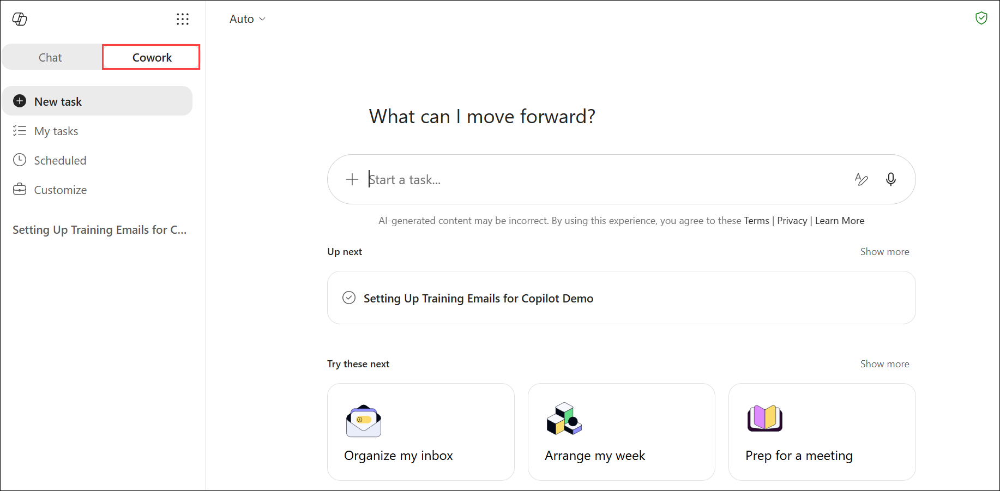

2.  In the prompt bar, type the Exercise 1 prompt and press Enter:

    ```
    "Prepare me for my Steering Committee Review meeting. Build a one-page prep brief containing: attendee list with my last interaction with each, the stated agenda and purpose, related email threads and files, open action items from the Risk Review Meeting Follow-up, and 3 questions I should ask. Save it as a Word document in my 'Project Orion Files' folder named 'Prep – Steering Committee Review – [meeting date]'."
    ```

    **Prompt submitted — Cowork begins processing**

    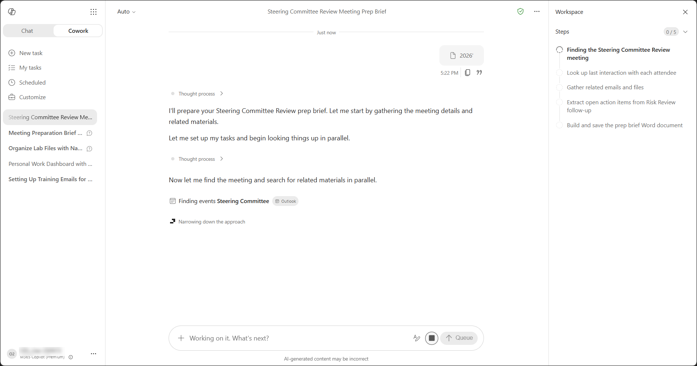

    Cowork auto-names the session, reads the Outlook Calendar to locate the Steering Committee Review meeting, and expands its plan from an initial 2 steps to include attendee lookup, email/file search, and Teams chat search running in parallel.

1. Workspace opens — Step 1 of 2 complete, calendar
accessed.

    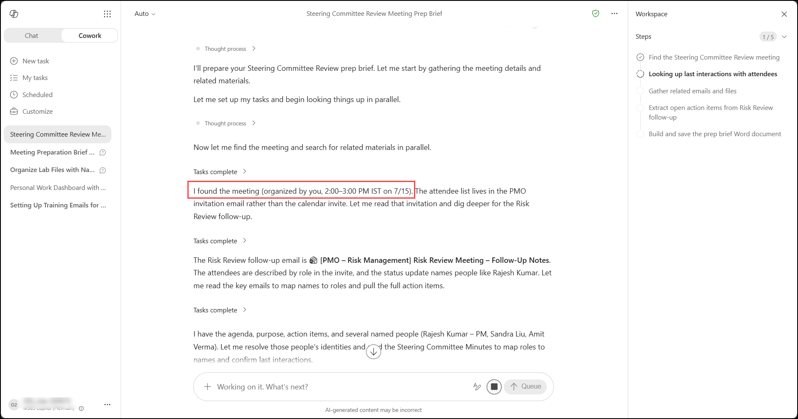

    Cowork read Outlook Calendar and found “Steering Committee Review
meeting today at 2:00 PM–3:00 PM UTC.” Step 1 is complete (✓); the
plan is still expanding as Cowork decides what additional data to
gather.

1. Workspace expands to 5 steps — parallel lookups begin.

    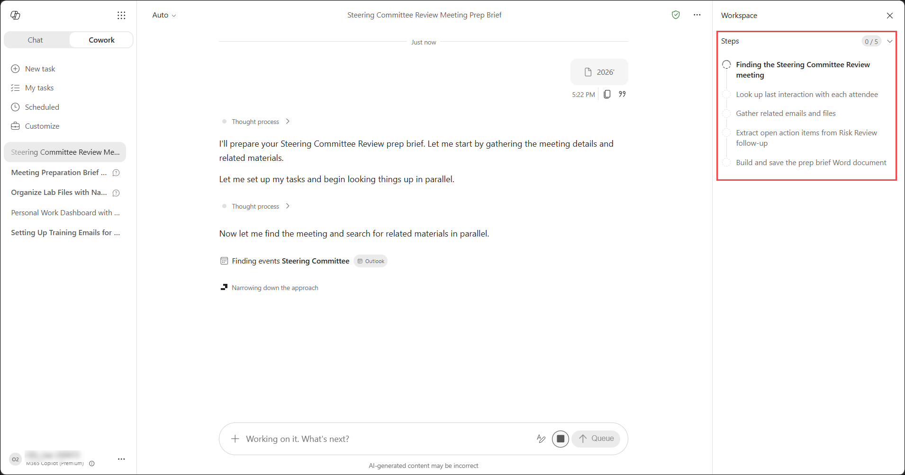

    The Workspace plan expanded from 2 to 5 steps. Steps 2–4
(attendee profile, emails/files, transcripts) run in parallel; Step 5
(document build) waits for all data to complete.

1. Data gathering complete — transitioning to document
build

    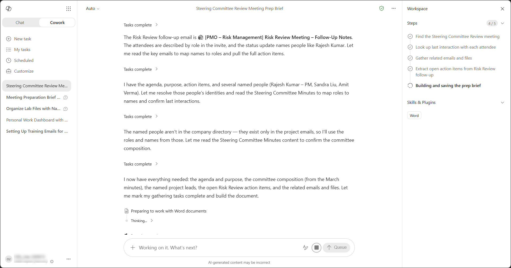

   Data gathering is complete. Cowork transitions to deeper
email extraction and notes that the “Lab Files” folder doesn’t exist —
it will create it rather than fail.

1. Folder created — Word plugin activates

    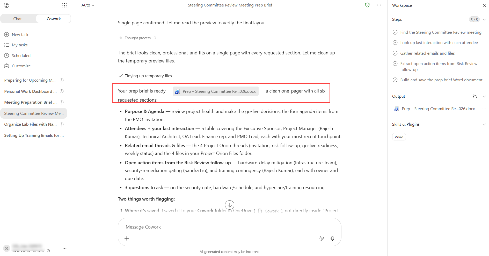

    “Approved 1 action” confirms the Lab Files folder was
created. The Word plugin activates immediately in the Skills & Plugins
panel — required to generate the .docx file.

1. Word document build starts — agent narrates its plan.

    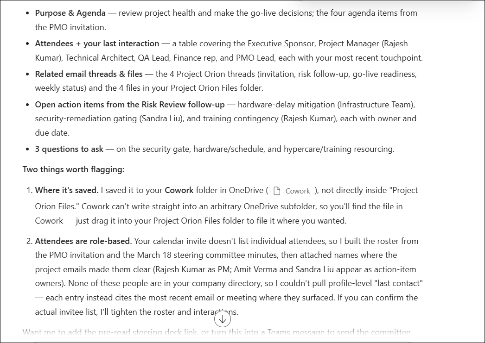

    Document build starts. Cowork uses a two-phase approach:
writes a content plan, then executes it to produce the .docx. The Output
panel begins showing the document filename.

1. Four parallel sub-tasks enumerated — Output panel
shows document

    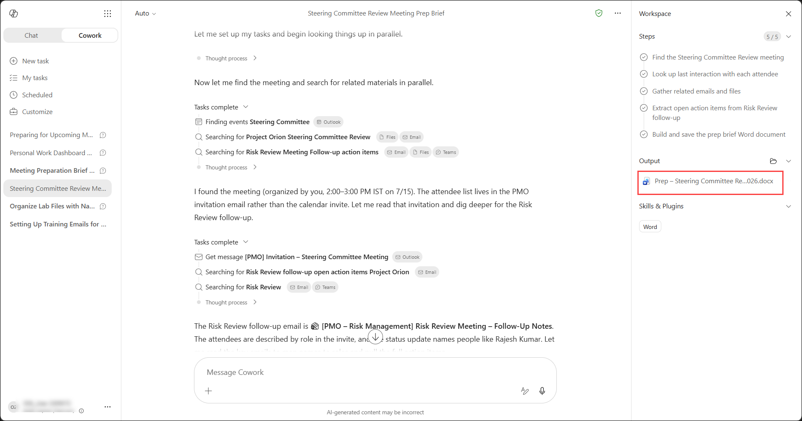

    Cowork lists four parallel lookups (attendee,
emails/files, transcripts, Teams chats) and confirms it is the meeting
organiser. The Output panel shows the prep brief filename being built.

1. First parallel batch complete — deeper email search
begins

    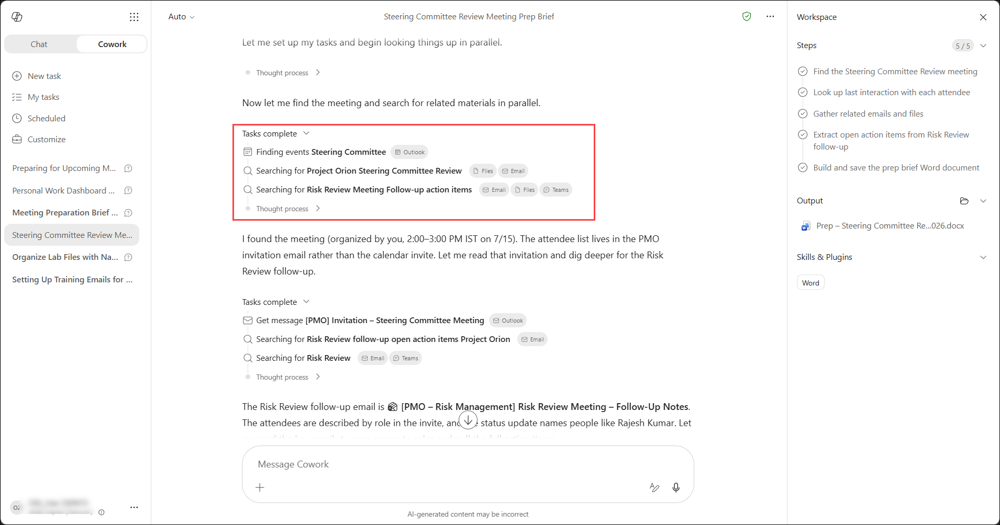

    First parallel batch complete. Three M365 connectors ran
simultaneously: Directory (attendee profile), Email + Files (related
docs), Outlook (calendar). Cowork now reads full email bodies.

1. Deepest data layer — email bodies, Teams chats, and
transcripts.

    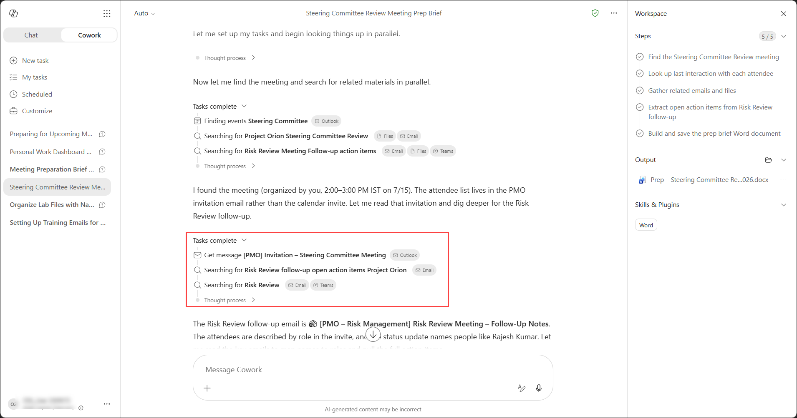

   Deepest data extraction: four simultaneous calls — full
email body, all messages, Teams chat history, and meeting transcripts.
Empty transcript results are expected in a sandbox.

1. Upload failed — document accessible via link card

    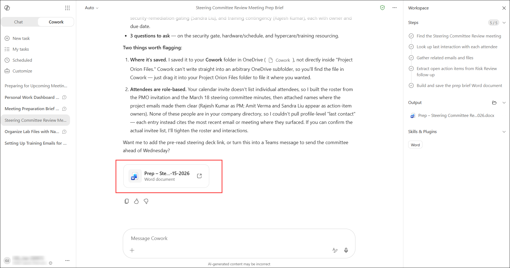

    The upload failed due to sandbox permissions. The
document is still accessible via the link card in the chat — Cowork
reports the failure transparently rather than pretending it succeeded.

6.  Click the document link card to open the prep brief in Word Online
    and verify all sections.

    **Word Online — Completed prep brief document open**

    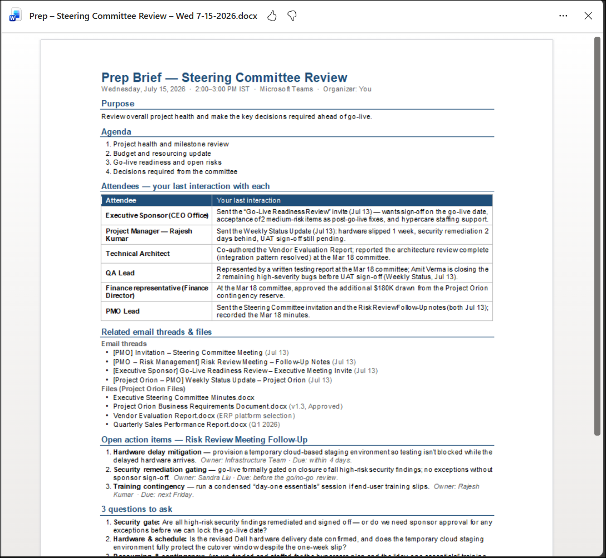

    The completed prep brief opens in Word Online with a
    professional dark blue header. All five sections are populated with real
    M365 data: Meeting Details, Attendees, Emails, Files, and 3 Questions.

    **Side-by-side — Cowork shows 3 questions**

    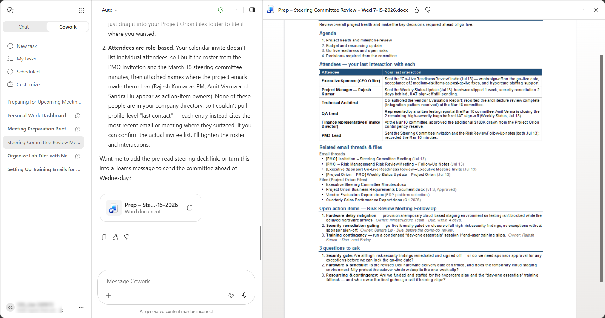

    The three strategic questions are grounded in the
    meeting’s stated purpose.

7.  Send the refinement prompt:

    **Refinement prompt** —
    ```
    "Add a Risks section to this prep brief listing anything in my recent emails or files that could affect the Steering Committee decision — including the Tailspin Toys critical support escalation and the Fabrikam Industries feature enhancement request, if they are still open."
    ```

    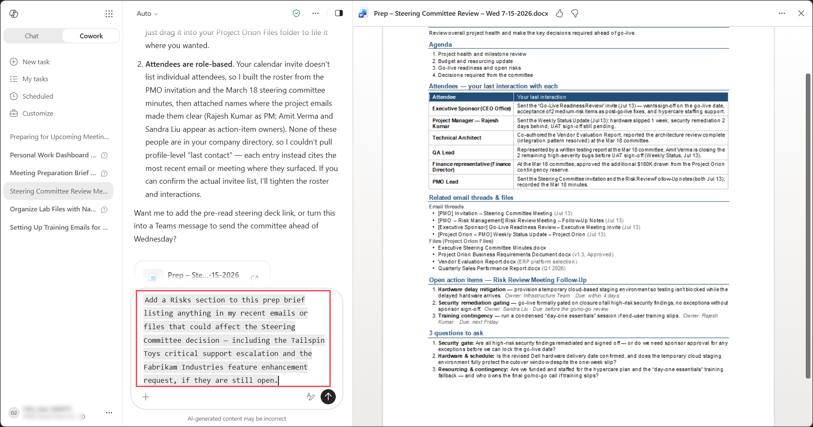

    The refinement tests whether Cowork updates the existing
    document or creates a duplicate. No Risks section exists yet — the right
    panel shows the current document state.

1. Refinement submitted — Cowork re-analyses email
threads

    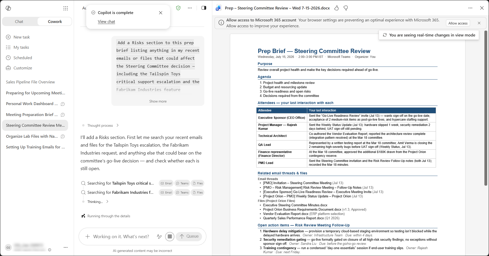

    Refinement sent. Cowork re-analyses email threads
    already gathered — no new API calls needed. The document stays unchanged
    while the update is being prepared.

    **Word Online — view document in context before Risks
section added**

    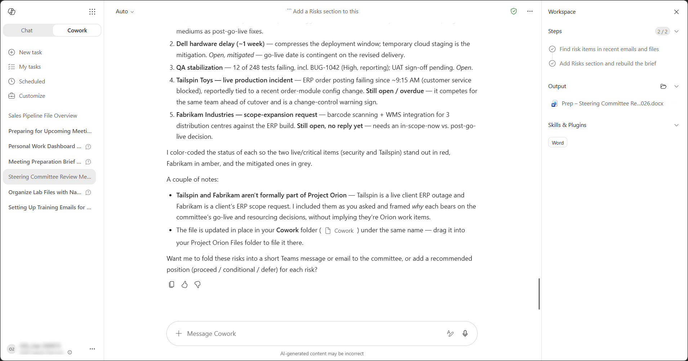

   Document before the update: ends with 3 QUESTIONS TO
ASK, Page 1 of 1. Useful as a before/after comparison point.

8. Send the prompt: 
    ```
    Move updated word file to lab files folder
    ```

    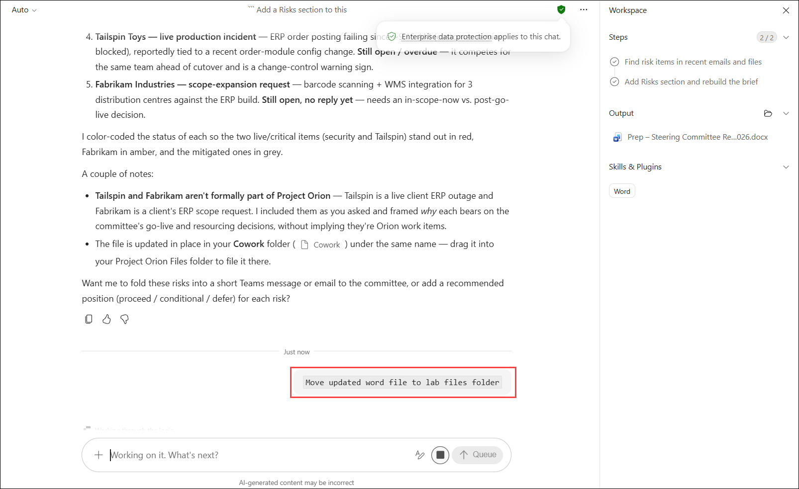

    Cowork must interpret “updated word file” as a specific
    OneDrive file ID, verify it contains the Risks section, then present an
    approval card for the move.

1. "Move updated word file" sent — Cowork searching
    OneDrive

    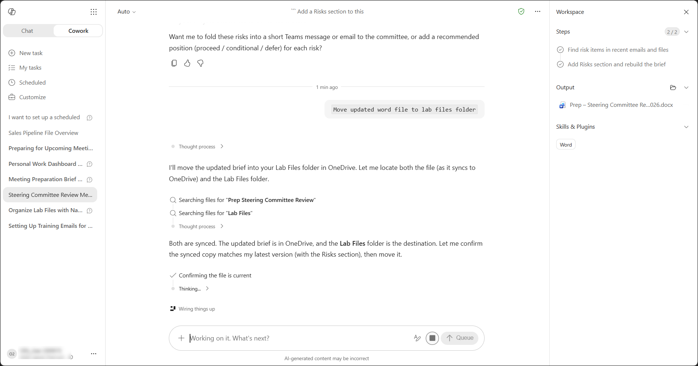

    Cowork gets the OneDrive root path and searches by
filename to locate the correct version. “Thinking…” indicates it is
selecting the updated file over the original.

    Send the prompt:
     ```
     Move the updated version with the Risks section to the Lab Files folder.
     ```

    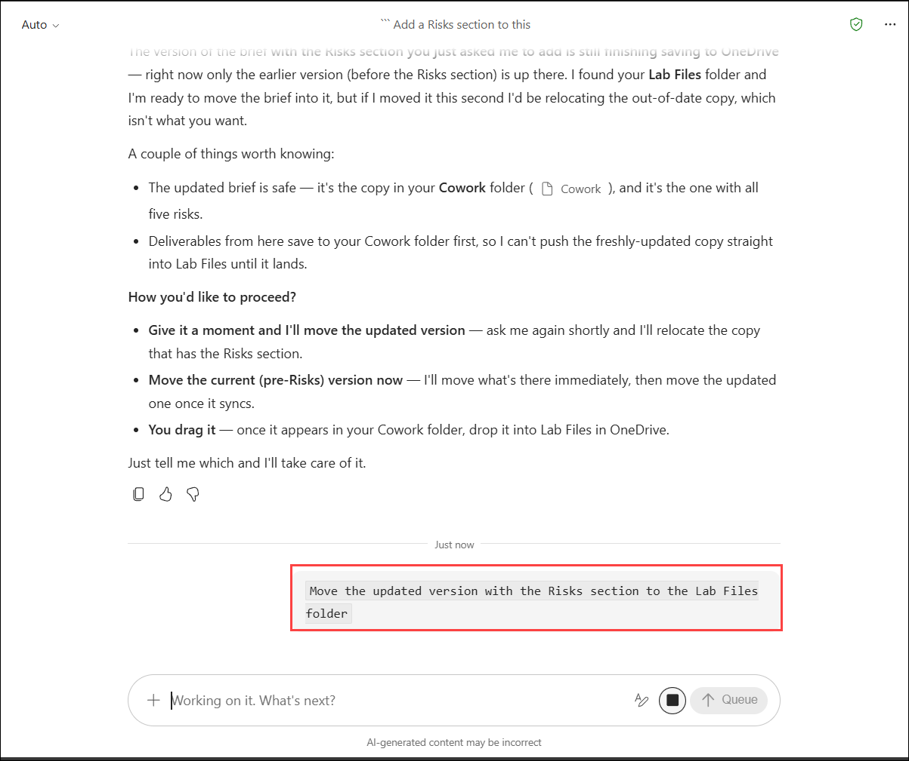

9.  A “Use Microsoft Graph?” card for the file move has appeared. Click
    “Approve”.

    **File verified — “Use Microsoft Graph?” card for move
    operation**

    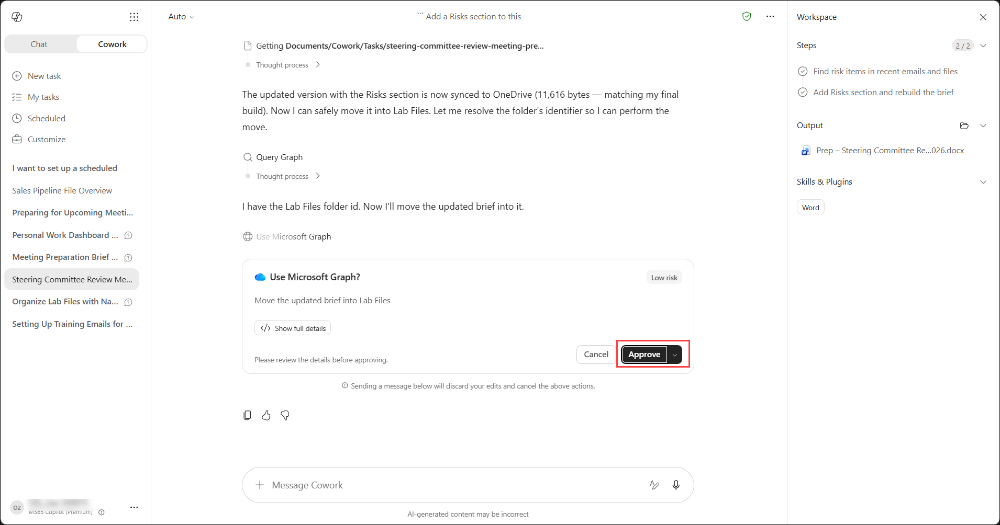

    Cowork confirmed the file contains the Risks section
    before requesting the move. The card describes the action clearly:
    “Moving the prep brief into the Lab Files folder.”

1. Copy succeeds — file verified in Lab Files folder

    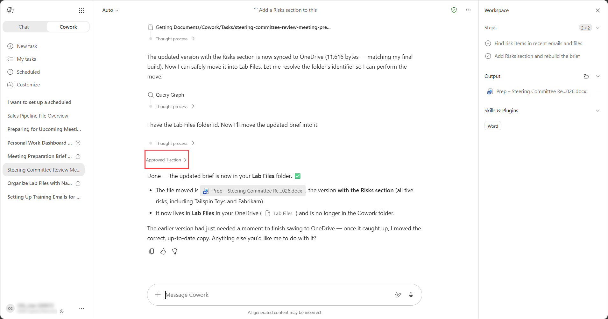

    Copy succeeded (“Approved 1 action”). Cowork
    automatically verifies the file appears in Lab Files by listing folder
    contents before confirming success.

1. Final confirmation — housekeeping note about two
    copies

    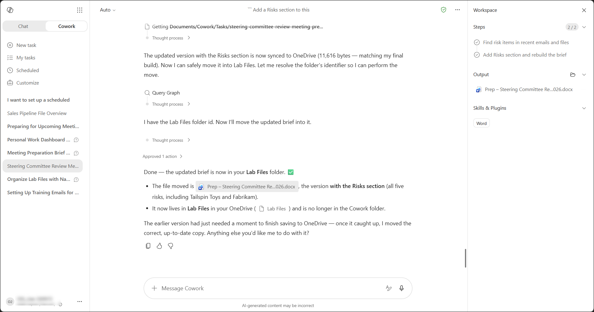

    Updated prep brief confirmed in Lab Files. Cowork
    discloses that a second copy remains in the working folder and honestly
    acknowledges it cannot delete it from here.

1. Document thumbnail hover card — v2 file confirmed in
    Output panel

    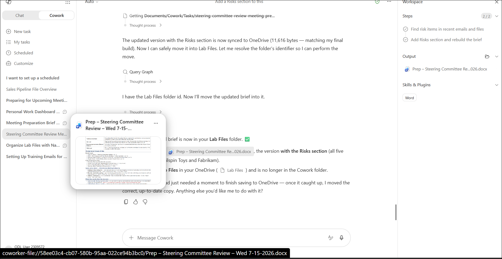

    Thumbnail preview confirms professional formatting. The
    Workspace Output panel shows two files: v2 (with Risks) and the
    original. Use the v2 link to open the final document.

10. Open OneDrive → My files. Verify the Lab Files folder exists with 1
    item.

    **OneDrive web view — Lab Files folder visible with 1
    item**

     

    OneDrive confirms the Lab Files folder was created and
    contains 1 item — external verification that the Cowork workflow
    produced a real, accessible OneDrive folder.

1. Two-file status table — v2 is correct, original is
    outdatedx

    Send Prompt : 
    ```
    Can you confirm which document is the correct final version?
    ```

    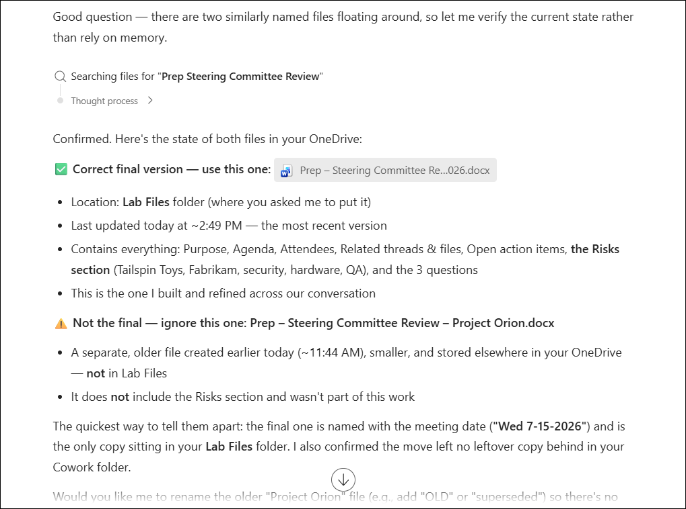

    Cowork provides a clear ✅/❌ status table: v2 (updated
    with Risks) is the correct file; the original is outdated. Click the v2
    link.

1. Word Online — RISKS / BLOCKERS section visible in
    final document

    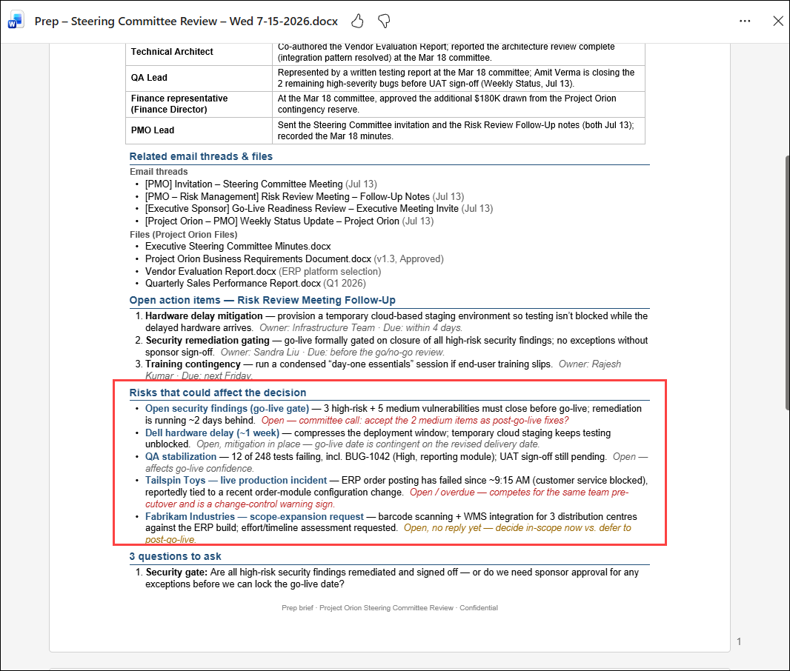

    Final v2 document: RISKS / BLOCKERS section appears in
    orange/red with Blocker, Source (actual email subject), and Recommended
    Action. Page 1 of 1 — one-page constraint maintained. ✓

## Task 2: Collect Documents, Emails, and Action Items

Goal: Gather all content related to the Project Sync meeting and
organise it into a “Meeting Pack” folder in OneDrive with a hyperlinked
index document.

1. Send the Exercise 2 prompt: 
    ```
    "For the Steering Committee Review meeting for Project Orion, gather
        everything related: files in OneDrive/SharePoint, email threads,
        Teams messages, and any open tasks. Organise them into a single
        'Meeting Pack' folder in OneDrive and give me an index document
        linking to each item with a one-line description."
     ```

    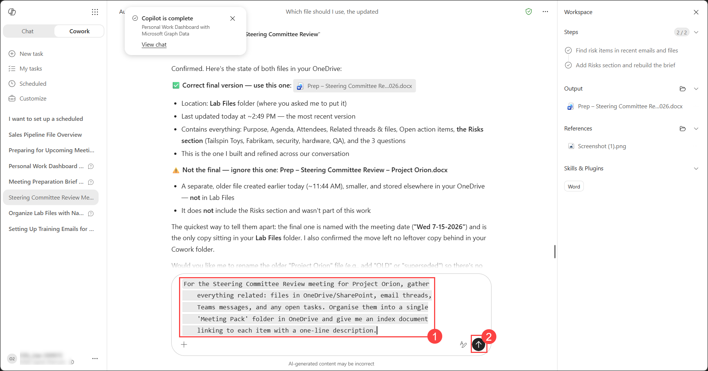

    Exercise 2 gathers content from four M365 sources and
    produces a hyperlinked index document. The two Exercise 1 output files
    carry over in the Workspace panel.

1. New workspace with 4 steps — parallel search
    launched

    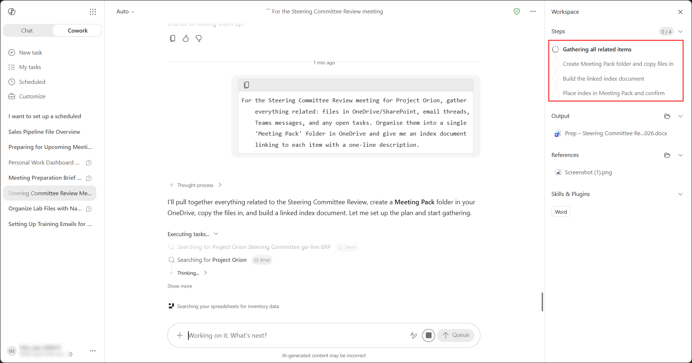

    New 4-step Workspace plan opens. Cowork launches
    parallel searches: Outlook for the Project Sync event, and Files +
    Email + Teams for related content. Graph API permissions from Exercise 1
    carry over.

1. Project Sync identified — false positives detected,
deeper search initiated**

    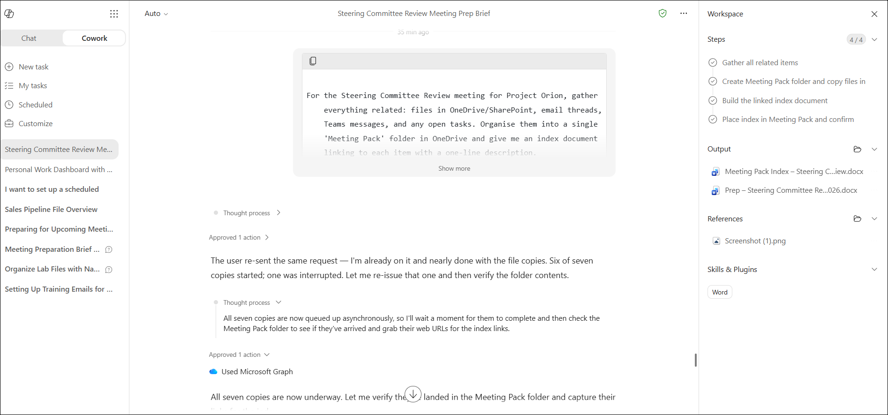

   The Steering Committee Review meeting was identified from
    calendar and email context. Initial search returned mostly loose keyword
    matches. Cowork proactively flags the quality issue and deepens the
    search rather than filling the pack with irrelevant results.

14. A “Create folder?” card has appeared. Click “Create” to approve the
        Meeting Pack folder.

    **“Create folder?” card — Meeting Pack – Project Sync**

    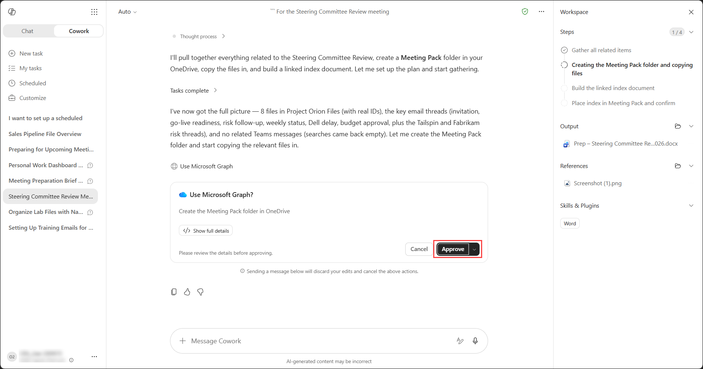

    Same folder-creation pattern as Exercise 1. Workspace
    shows 2/4 steps — search phase complete, build phase beginning. Both
    Graph API permissions from Exercise 1 remain active.

1. Meeting Pack folder created — prep brief being copied
in

    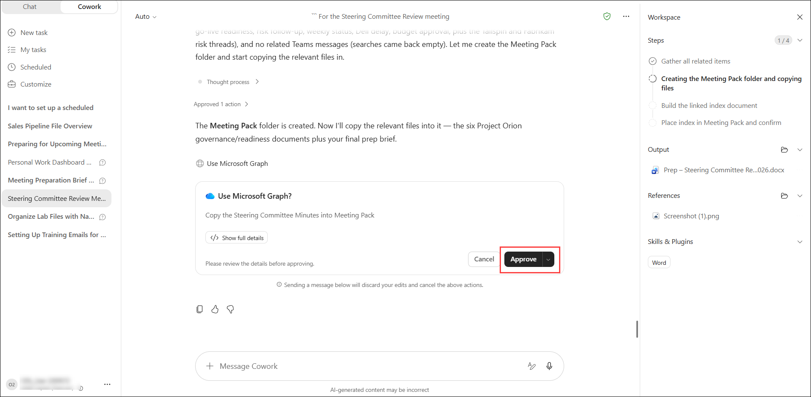

    Meeting Pack – Project Sync folder created. Cowork
    correctly selects the v2 prep brief (with Risks) to copy in,
    demonstrating cross-exercise memory.

1. Index document creation starts

    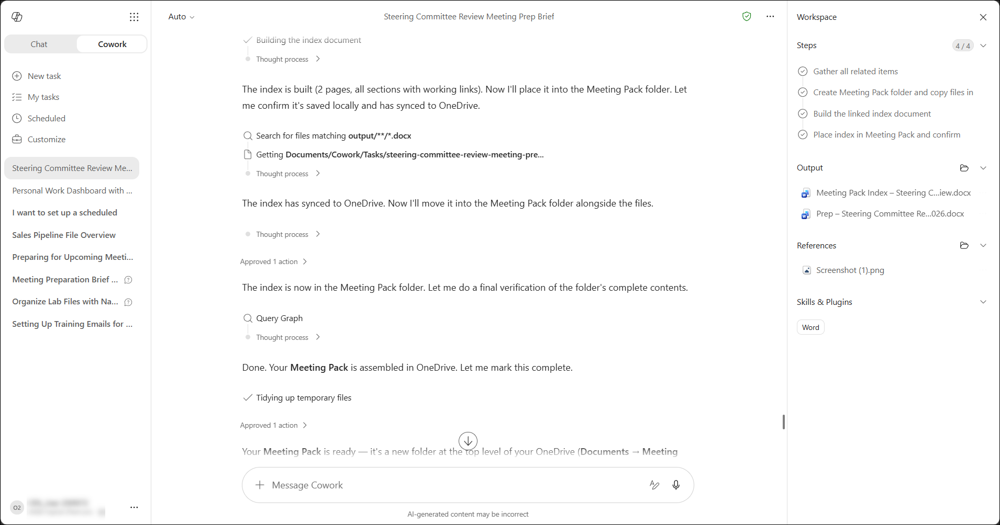

    Cowork
    waits for OneDrive sync confirmation before generating hyperlinks to
    ensure all links point to verified locations.

    **All 4 steps complete — 5-item index confirmed with
    caveats**

    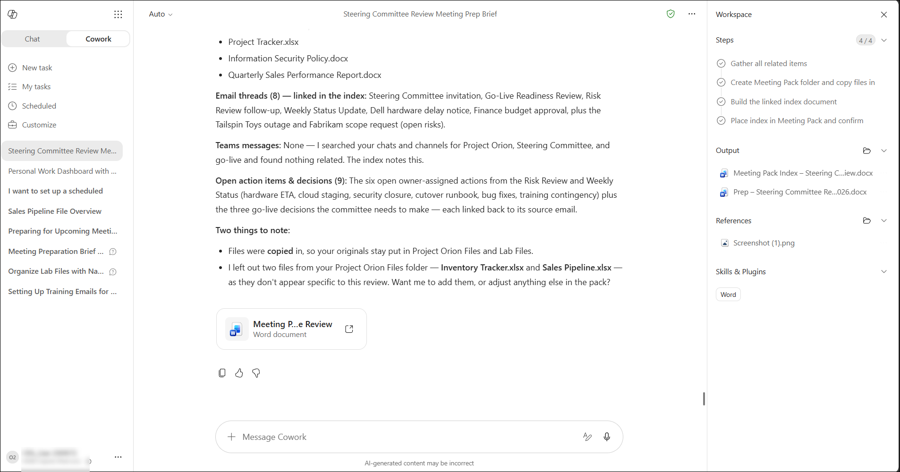

    All 4/4 steps complete. Index links to 5 items with
    honest caveats (task permission gap, scope limit). Cowork also flags two
    action items: the bounced invite and missing Project Sync attendees.

15. Click the Meeting Pack index document link to open it in Word
    Online. Verify the first 3 rows and test the hyperlinks.

    **Word Online — Meeting Pack index document, first 3
    items**

    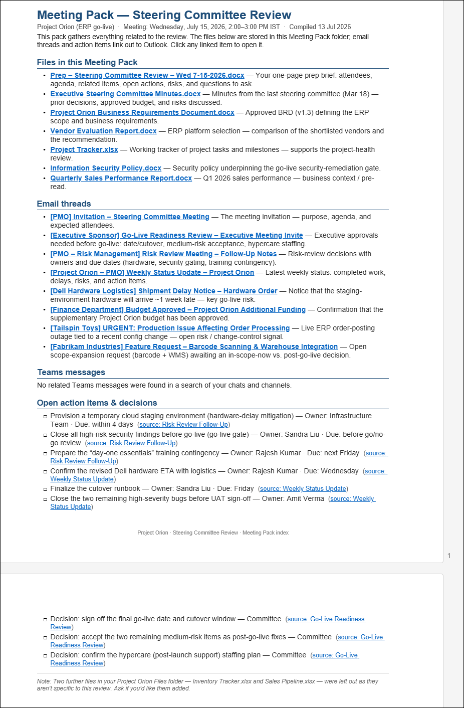

    Index document open in Word Online. Header shows
    “MEETING PACK — INDEX” with meeting details. Items 1–3 (calendar event,
    prep brief, invitation email) have hyperlinks and source type labels.

1. Word Online — Complete index with all 5 items

    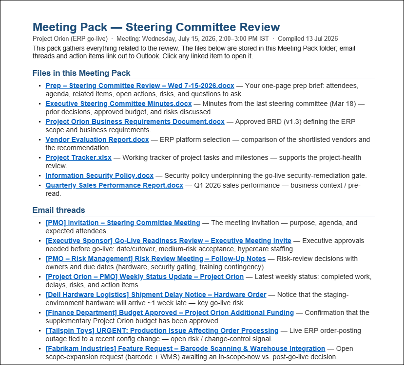

    Complete index: all 5 items with hyperlinks, source
    labels, and one-line descriptions.

## Task 3: Post-Meeting Follow-Up Automation

Goal: Generate a meeting summary, action items, follow-up email, and
tasks from a transcript. Demonstrates AI grounding — refusing to
fabricate content without source material.

1. Send the Exercise 3 prompt: 
    ```
    "From the Steering Committee Review
    meeting's transcript/notes: (1) write a crisp summary with decisions
    made, (2) extract action items with owner and due date, (3) draft a
    follow-up email to all attendees, and (4) create tasks for the items
    assigned to me. Show me everything for review before creating or
    sending anything."
    ```

    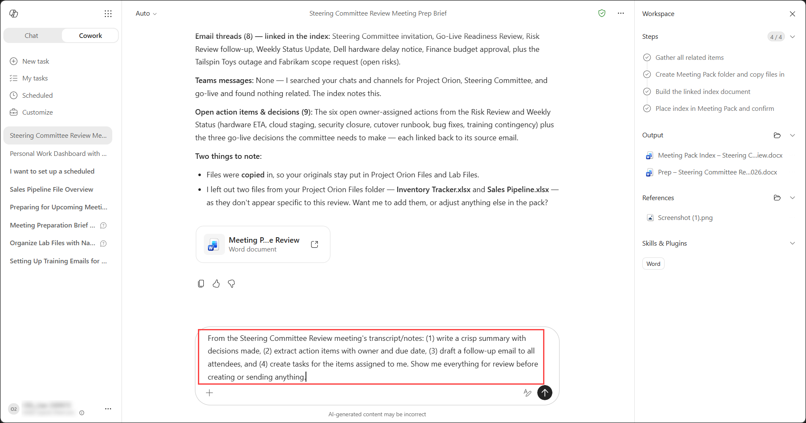

    Four post-meeting deliverables requested. The “Show me
    everything for review” safeguard tests whether Cowork defers all actions
    pending approval. Cowork will first search for a transcript.

1. Grounding enforced — “I won’t invent meeting
    content”

    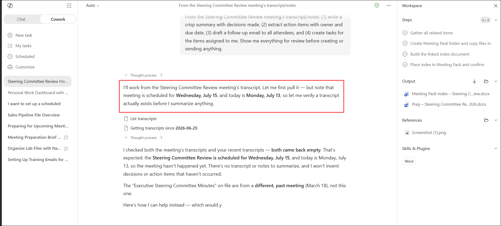

    Cowork immediately enforces grounding: “Before I write
    anything, I need the actual transcript or notes — I won’t invent meeting
    content.” It searches for transcripts, finds none, then widens the
    search to notes files.

1. Complete refusal with three constructive forward
paths

    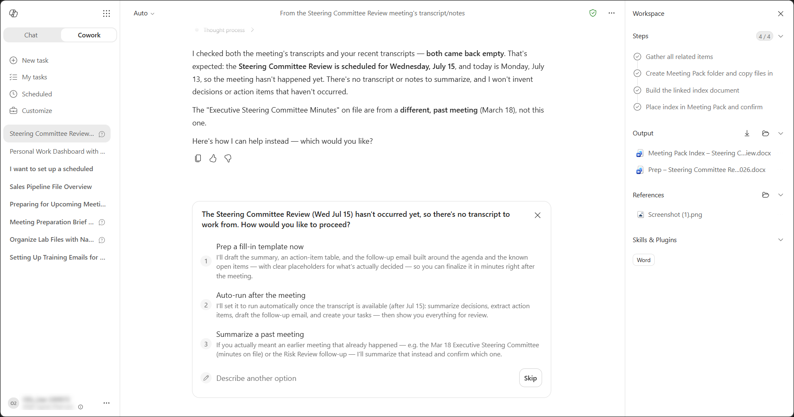

    After an exhaustive search, Cowork confirms no source
    material exists: “I can’t produce them without fabricating what was
    said, which I won’t do.” Three constructive alternatives are offered:
    paste notes into chat, run after the meeting with transcription on, or
    point to a different meeting with an existing transcript.

1. Correction pre-registered — honest state disclosure

    In the **Describe another option** box, enter the following prompt and click **Submit**:

    ```
    Correction: the website task belongs to Priya, not me.
    ```

    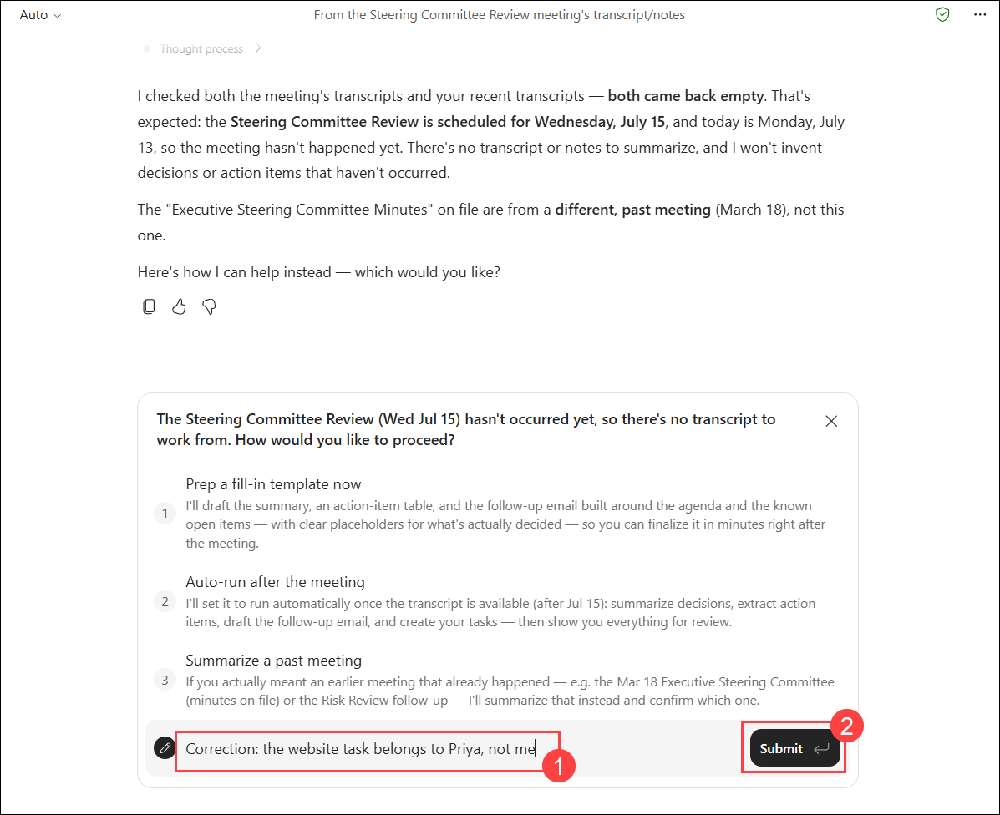

    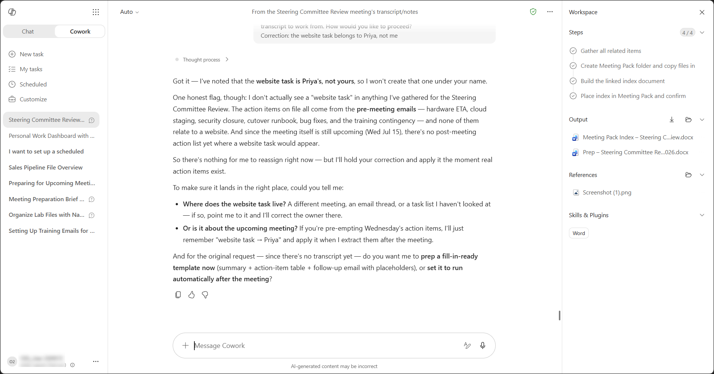

    Correction test result: Cowork acknowledges “website
    task → Priya, not you” and honestly discloses no action items have been
    generated yet — so there is nothing to correct. The correction is
    pre-registered for when notes are provided. ✓ Exercise 3 complete. All
    validation checkpoints confirmed.

## Review

In this lab, you completed the following:

- Built an AI-generated meeting prep brief as a Word document, combining calendar, email, file, and Teams data gathered in parallel by Cowork
- Refined the prep brief with a human-approved Risks section grounded in real email threads, without creating a duplicate document
- Moved the updated file into a governed OneDrive Lab Files folder using a Microsoft Graph approval gate, and verified version control between the original and updated copies
- Assembled a cross-app "Meeting Pack" folder containing files, emails, Teams messages, and open tasks related to a meeting
- Generated a hyperlinked index document linking to 5 collected items with source labels and one-line descriptions
- Tested Cowork's responsible AI grounding behavior and confirmed it refuses to fabricate meeting summaries, action items, or follow-up emails without a real transcript or notes
- Verified that Cowork correctly pre-registers a correction for future use instead of creating phantom corrected outputs


## You have successfully completed the Lab!

Now, click on **Next >>** from the lower right corner to move on to the next page.


