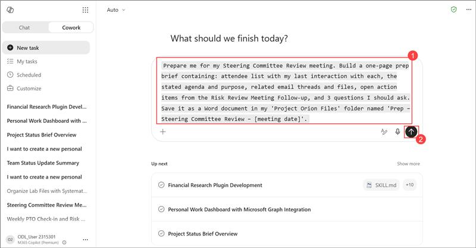
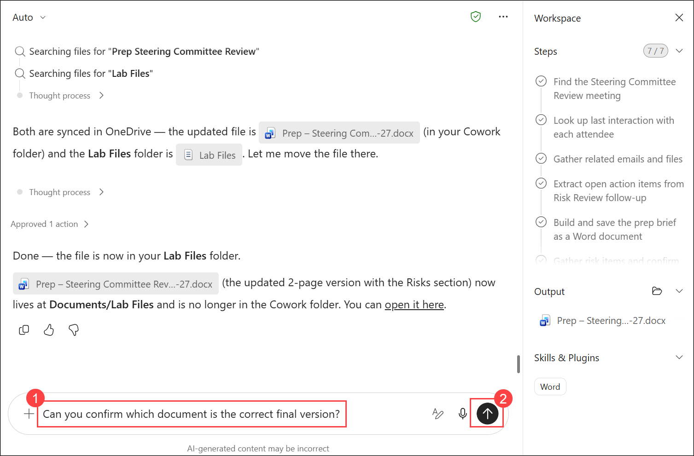

# Lab 4: Executive Meeting Coordinator

### Estimated Duration: 45 minutes

## Overview

In this hands-on lab, you will use Copilot Cowork to automate the full lifecycle of an executive meeting - from preparation through to post-meeting follow-up - grounded entirely in real Microsoft 365 data. You will generate a one-page meeting prep brief as a Word document by having Cowork pull attendee history, agenda details, related emails and files, and open action items in parallel from Outlook, OneDrive/SharePoint, and Teams. You will refine that document with a human-approved Risks section, move the updated file into a governed OneDrive folder using a Microsoft Graph approval gate, and verify version control along the way. You will then assemble a cross-app "Meeting Pack" with a hyperlinked index document, and finally test Cowork's responsible AI grounding behavior by asking it to generate post-meeting deliverables from a transcript that does not exist - confirming that it refuses to fabricate content and instead offers constructive alternatives.


## Objectives

In this lab, you will perform the following:


- Task 1: AI-Generated Meeting Preparation
- Task 2: Collect Documents, Emails, and Action Items
- Task 3: Post-Meeting Follow-Up Automation

## Task 1: AI-Generated Meeting Preparation

In this task you will build a cross-app meeting prep brief as a Word document saved to OneDrive Lab Files. Data gathered from Calendar, Email, OneDrive/SharePoint, and Teams in parallel.

1.  Go to the Cowork tab.

    

2.  In the prompt bar, enter the below **prompt (1)** and click the **Send (2)** button:

    ```
    "Prepare me for my Steering Committee Review meeting. Build a one-page prep brief containing: attendee list with my last interaction with each, the stated agenda and purpose, related email threads and files, open action items from the Risk Review Meeting Follow-up, and 3 questions I should ask. Save it as a Word document in my 'Project Orion Files' folder named 'Prep - Steering Committee Review - [meeting date]'."
    ```
    

    

1. After submitting the prompt, you can see that Cowork has started processing the request.

    

1. Monitor the **Workspace** pane and verify that Cowork has started processing the task by confirming the **Finding the Steering Committee Review meeting** step is in progress and the remaining workflow steps are listed.

    

1. Folder created - Word plugin activates

    

1. “Approved 1 action” confirms the Lab Files folder was
created. The Word plugin activates immediately in the Skills & Plugins
panel - required to generate the .docx file.

1. First parallel batch complete - deeper email search
begins

    

1. Click the document link card to open the prep brief in Word Online and verify all sections.

    

6. Review the word file.

    

    

7.  Send the refinement prompt: In the Cowork pane, enter the below prompt (1) and click the send (2) button:
 
    ```
    "Add a Risks section to this prep brief listing anything in my recent emails or files that could affect the Steering Committee decision - including the Tailspin Toys critical support escalation and the Fabrikam Industries feature enhancement request, if they are still open."
    ```

    

1. Word Online - view document in context before Risks
section added, Review the output generated by Cowork and continue.
 

    

8. Enter the below prompt (1) and click the send (2) button:
    ```
    Move updated word file to lab files folder
    ```

    

1. Enter the below prompt (1) and click the send (2) button:
     ```
     Move the updated version with the Risks section to the Lab Files folder.
     ```

    

9.  Review the output generated by Cowork and continue. Click
    "Approve".

    

1. Final confirmation - housekeeping note about two
    copies

    

10. Review the output generated by Cowork and continue,
 Open OneDrive → My files. Verify the Lab Files folder exists with 1
    item.

     

1. Enter the below **prompt (1)** and click the **send (2)** button:
    ```
    Can you confirm which document is the correct final version?
    ```

    

    

## Task 2: Collect Documents, Emails, and Action Items

In this task you will gather all content related to the Project Sync meeting and
organise it into a "Meeting Pack" folder in OneDrive with a hyperlinked
index document.

1. Enter the below **prompt (1)** and click the **send (2)** button:

    ```
    "For the Steering Committee Review meeting for Project Orion, gather everything related: files in OneDrive/SharePoint, email threads, Teams messages, and any open tasks. Organise them into a single 'Meeting Pack' folder in OneDrive and give me an index document linking to each item with a one-line description."
     ```

    

1. Review how cowork started processing in steps in workspace.

    

14. A "Create folder?" card has appeared. Click **“Approve** to approve the Meeting Pack folder.

    

1. Click on **Approve** to approve all the other requests. 

    

1. Review the output generated by cowork along with the word document.

    

    

15. Click the Meeting Pack index document to open it and review the file.

    

    >**Note:** As Cowork uses AI to generate responses, the output might not be the exact same as shown in the above images.

## Task 3: Post-Meeting Follow-Up Automation

In this task you will generate a meeting summary, action items, follow-up email, and
tasks from a transcript. Demonstrates AI grounding — refusing to
fabricate content without source material.

1. Enter the below prompt (1) and click the send (2) button: 

    ```
    "From the Steering Committee Review
    meeting's transcript/notes: (1) write a crisp summary with decisions
    made, (2) extract action items with owner and due date, (3) draft a
    follow-up email to all attendees, and (4) create tasks for the items
    assigned to me. Show me everything for review before creating or
    sending anything."
    ```

    

1. Correction pre-registered — honest state disclosure

    In the **Describe another option** box, enter the following prompt and click **Submit**:

    ```
    Correction: the website task belongs to Priya, not me.
    ```

    

    
 

## Review

In this lab, you completed the following:

- Built an AI-generated meeting prep brief as a Word document, combining calendar, email, file, and Teams data gathered in parallel by Cowork
- Refined the prep brief with a human-approved Risks section grounded in real email threads, without creating a duplicate document
- Moved the updated file into a governed OneDrive Lab Files folder using a Microsoft Graph approval gate, and verified version control between the original and updated copies
- Assembled a cross-app "Meeting Pack" folder containing files, emails, Teams messages, and open tasks related to a meeting
- Generated a hyperlinked index document linking to 5 collected items with source labels and one-line descriptions
- Tested Cowork's responsible AI grounding behavior and confirmed it refuses to fabricate meeting summaries, action items, or follow-up emails without a real transcript or notes
- Verified that Cowork correctly pre-registers a correction for future use instead of creating phantom corrected outputs


## You have successfully completed the Lab!

Now, click on **Next >>** from the lower right corner to move on to the next page.


