# Lab 6 – Building Custom Cowork Skills

### Estimated Duration: 90 minutes

## Overview

In this hands-on lab, you will use Copilot Cowork's conversational AI Skill Builder to create two reusable custom skills. Rather than filling out forms or writing code, you will describe each skill in plain language and answer a series of follow-up questions while Cowork generates the skill automatically. You will plan a skill specification on paper, build a Leadership Update skill and test it against a sample input, build a second Project Status Brief skill with a full specification, download and review the generated skill definition file, invoke the skill using its trigger phrase, and publish its output directly to a Microsoft Teams channel with human approval at the write step. Finally, you will inspect a skill's details and review its management options, including Download, Edit Instructions, and Delete.

## Objectives

In this lab, you will perform the following:

- Task 1: Design Your Skill on Paper First
- Task 2: Build the Leadership Update Skill
- Task 3: Select the Skill Purpose
- Task 4: Test the Leadership Update Skill
- Task 5: Build the Project Status Brief Skill
- Task 6: Review the Completed Skill and Output Files
- Task 7: Run the Project Status Brief and Post to a Teams Channel
- Task 8: Post the Project Status Brief to a Teams Channel
- Task 9: Inspect, Edit, Download, and Delete Skills

## Task 1: Design Your Skill on Paper First

Before touching any tool, spend 5 minutes planning. A clear spec leads
to a much better skill. Rushing straight to the builder is the most
common reason skills turn out vague and unreliable.

Open Microsoft 365 Copilot Cowork

1. Open a web browser.

1. In the address bar, enter the following URL and press **Enter**:

    ```text
    https://m365.cloud.microsoft
    ```

1. Sign in using the provided lab credentials.

1. After signing in, select **Cowork** from the left navigation pane.

1. Verify the **Cowork** home page opens successfully.

    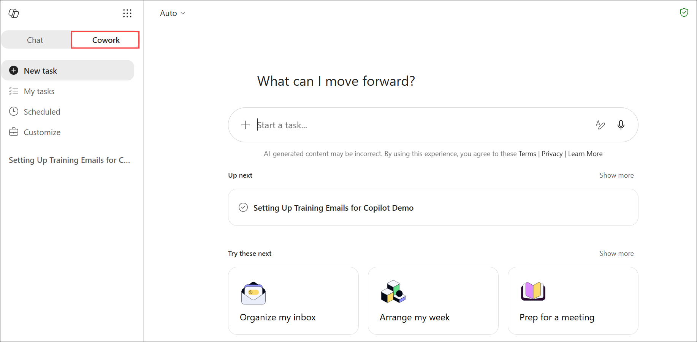

    Microsoft 365 Copilot Cowork home page.

1. Verify the following components are available:

    - **New task**
    - **My tasks**
    - **Scheduled**
    - **Customize**
    - **Recent task history**
    - **Cowork prompt box**

1. Confirm the **Cowork** tab is selected before proceeding to the next task.

    Open Notepad and Capture Planning Requirements

1. Open the **Start** menu.

1. Search for **Notepad** and select the application from the search results.

    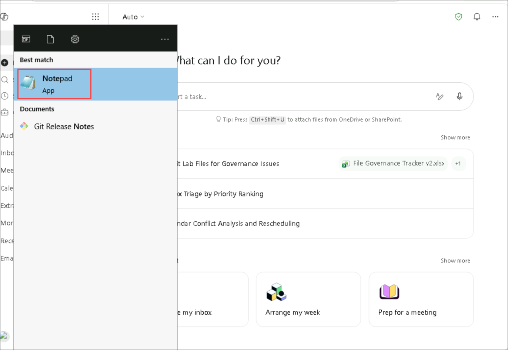

    Notepad application located from the Windows search results.

1. Open **Notepad** and resize the window so it is visible alongside the browser window.

1. In Notepad, enter the following planning questions:

    ```text
    What should this skill do?

    What does it need to read?

    Does it write or change anything?

    What should the output look like?

    Is there a variable that might change?
    ```

1. Verify all five planning questions have been added to the Notepad document.

    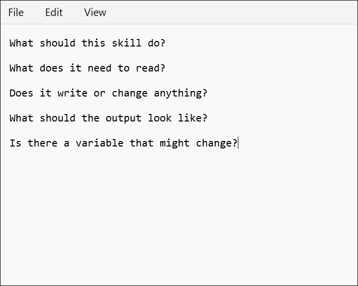

    Planning questions entered into Notepad.

1. Review each question and enter your responses below the corresponding question.

1. Save the notes for reference during the remaining exercises.

1. Keep the Notepad window open and accessible while working through the lab.

    Create the Skill Specification

1. In the existing **Notepad** document, scroll below the planning questions and responses entered in the previous task.

1. Add a new section for the skill specification.

1. Enter the following Skill Specification fields:

    ```text
    Skill Name:

    Trigger Phrase:

    Parameters:

    Apps It May Read:

    Apps It May Write:

    Output Format:
    ```

1. Complete each field based on the requirements of the Leadership Update skill.

1. Verify the Skill Specification contains all required information.

    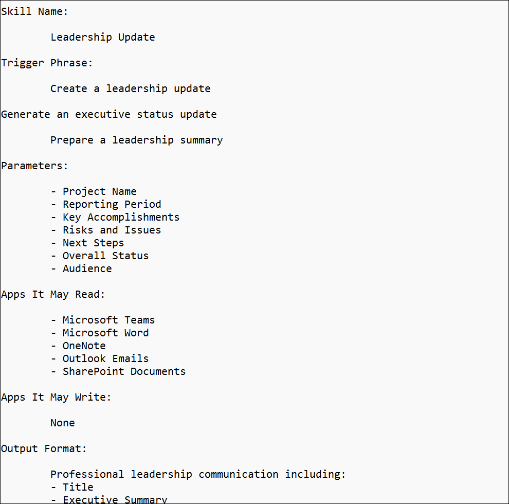

    Skill Specification template completed in Notepad.

1. Review the Skill Specification and confirm the following details are documented:

    - Skill Name
    - Trigger Phrase
    - Parameters
    - Apps It May Read
    - Apps It May Write
    - Output Format

1. Save the Notepad document.

1. Keep the Skill Specification available for reference during the remaining exercises.

1. Do not paste the Skill Specification into Copilot Cowork unless instructed later in the lab.

## Task 2: Build the Leadership Update Skill

> [!IMPORTANT]
> Earlier versions of this lab described a manual form with fields such as **Name**, **Description**, and **Scope**. The current **Copilot Cowork Skill Builder** no longer uses this form. Instead, the entire skill creation experience is **fully conversational**—Copilot Cowork asks a series of questions, gathers the required information, and generates the skill automatically, as demonstrated in the screenshots throughout this lab.

Open the Customize Area and Access Skills

1. On the **Copilot Cowork** home page, click the **+** icon located beside the prompt bar.

1. Review the available options displayed in the menu.

1. Select **Customize**.

    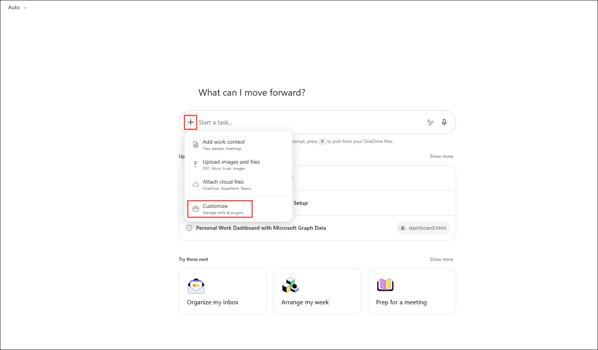

    Customize option displayed from the Add menu.

1. Verify the **Customize** page opens successfully.

1. Review the available tabs on the Customize page.

1. Select the **Skills** tab.

1. Review the Skills page and confirm the following sections are available:

    - Your skills
    - Built-in Skills
    - Add button

      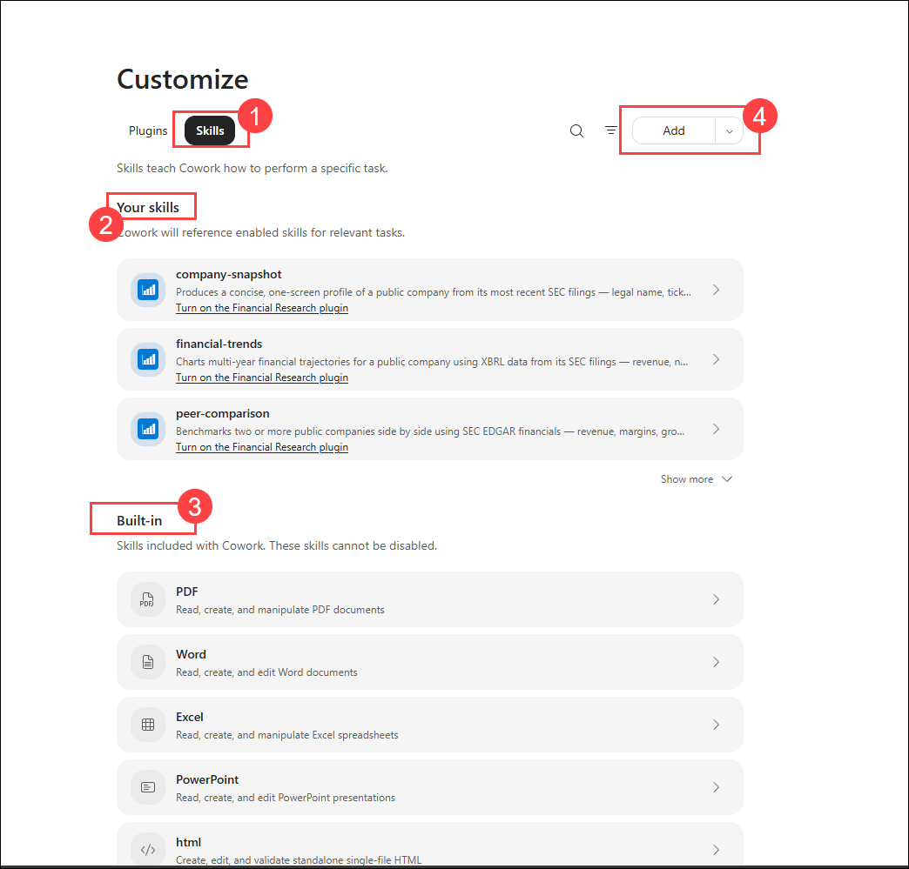

      Skills management page displaying built-in skills and skill creation options.

1. Verify the built-in skills are available:

    - PDF
    - Word
    - Excel

1. Locate the **Add** button in the upper-right corner of the page.

    Create a New Skill

1. On the **Skills** page, click the **Add** button located in the upper-right corner.

1. Review the available options in the dropdown menu.

1. Select **+ Create new** to start creating a new personal skill.

   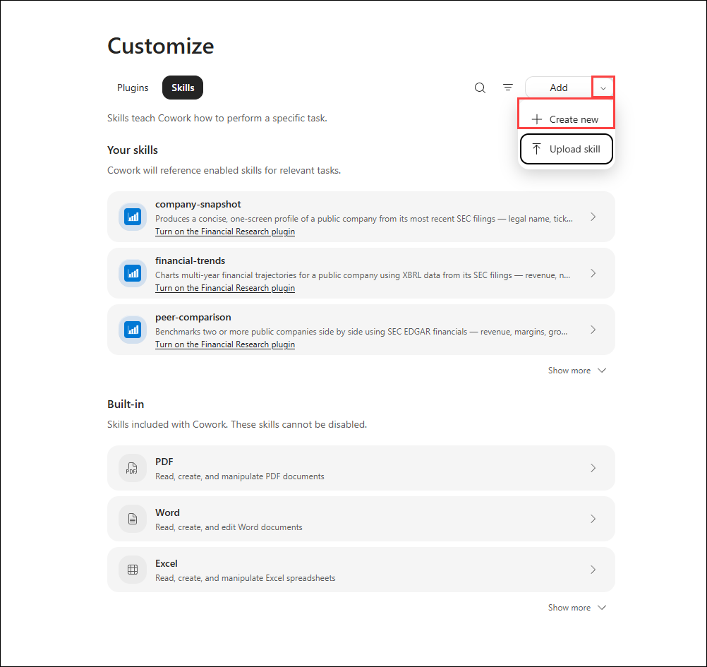

    Add menu displaying the Create new and Upload skill options.

1. Verify the skill creation process starts successfully.

1. Confirm a new skill creation entry appears in the left navigation pane.

    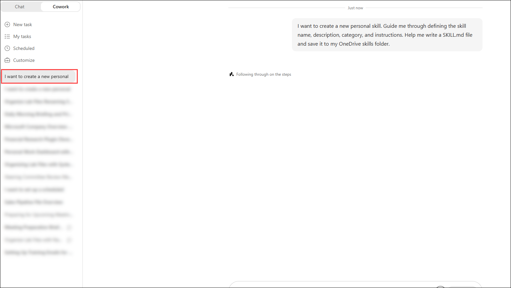

    New skill creation workflow initiated.

1. Verify the skill builder is ready to collect information about the new skill.

    Skill purpose and configuration questions displayed.

1. Review the questions presented by the skill builder before proceeding to the next task.

1. Do not enter any responses until the skill definition prompts have finished loading.

## Task 3: Select the Skill Purpose

1. Review the skill creation response generated by Copilot Cowork.

1. Verify the skill builder presents the available skill purpose options.

1. Review the following options:

    - Draft a recurring document
    - Format or transform content
    - Communication template
    - Data and analysis routine

      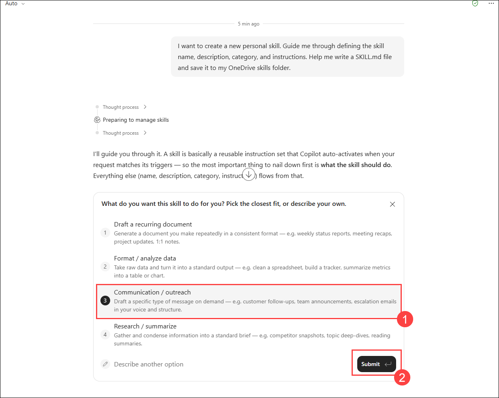

      Skill purpose selection options displayed in Copilot Cowork.

1. Select **Communication template**.

1. Click **Submit** to confirm the selected skill purpose.

1. Wait for Copilot Cowork to proceed to the next skill configuration step.

1. Verify the skill builder accepts the selected purpose and continues the skill creation workflow.

    Select the Message Type

1. Review the message type options presented by Copilot Cowork.

1. Verify the available message types include:

    - Leadership / executive update
    - Team announcement
    - Customer / client reply
    - Project status email

    Message type selection options displayed in the skill builder.

1. Review the description for **Leadership / executive update**.

1. Select **Leadership / executive update**.

     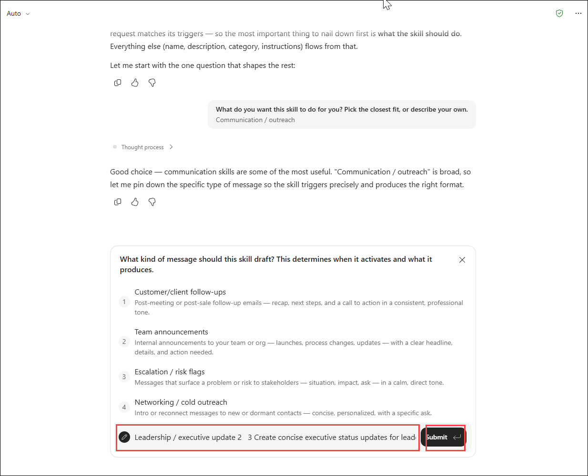

    Leadership / executive update option reviewed before selection.

1. Verify the **Leadership / executive update** option is selected.

    Monitor Skill Creation and Review the Generated Skill

1. After submitting the message type selection, monitor the **Workspace** pane while Copilot Cowork begins creating the skill.

1. Verify the Workspace pane displays **3/3** completed steps.

    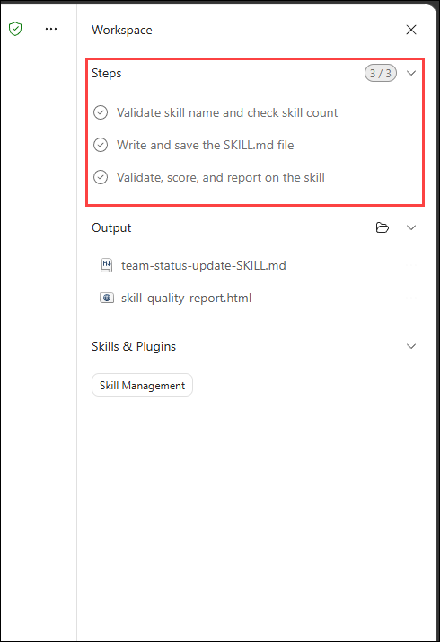

    Skill creation completed successfully.

1. Review the output generated by Copilot Cowork.

1. Verify the following files are available in the **Output** section:

    - `team-status-update-SKILL.md`
    - `skill-quality-report.html`

      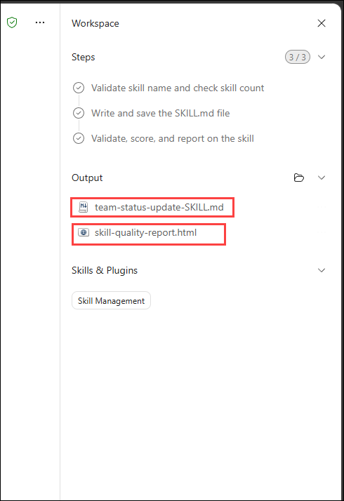

      Generated skill files available in the Output section.

1. Review the completion summary generated by Copilot Cowork.

1. In the **Output** section, locate **skill-quality-report.html**.

1. Close the Workspace pane by selecting the **Close (X)** button.

    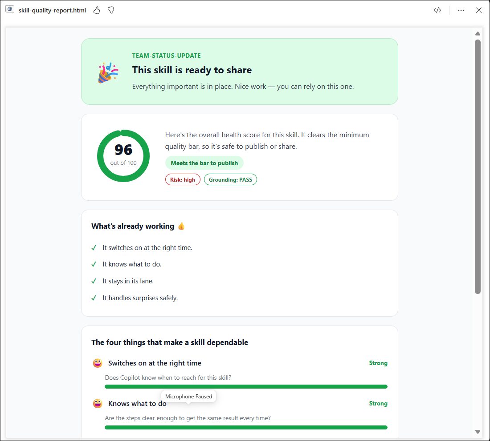

    Skill creation completed and Workspace pane ready to close.

1. Verify the skill has been created successfully before proceeding to the next exercise.

## Task 4: Test the Leadership Update Skill

A skill is only useful if it runs when you call it. This exercise tests
the skill with a sample input and confirms the Workspace panel activates
correctly.

Return to the Copilot Cowork Home Page

1. In the left navigation pane, select **New task**.

1. Verify the Copilot Cowork home page opens successfully.

    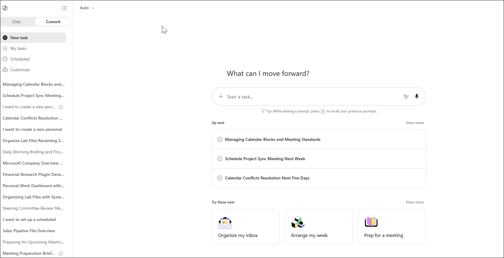

    Copilot Cowork home page displayed.

1. Review the available sections on the home page.

1. Verify the following components are visible:

    - Cowork prompt box
    - Recent tasks
    - Suggested tasks
    - Copilot Cowork home page content

1. Select the task input box to begin a new task.

    Submit the Skill Validation Prompt

1. In the Copilot Cowork prompt box, enter the skill validation prompt 

    ```
    Use team-status-update

    Summarize the following information into an executive-ready leadership update:

    Over the past week, several key initiatives have made progress. Most planned activities are on schedule, although a few tasks are taking longer than expected due to resource constraints. Team collaboration has improved, and stakeholder engagement remains positive. Some risks have been identified that may impact upcoming deadlines if not addressed. Additional support may be needed to maintain momentum.
    ```

1. Review the prompt before submitting it.

    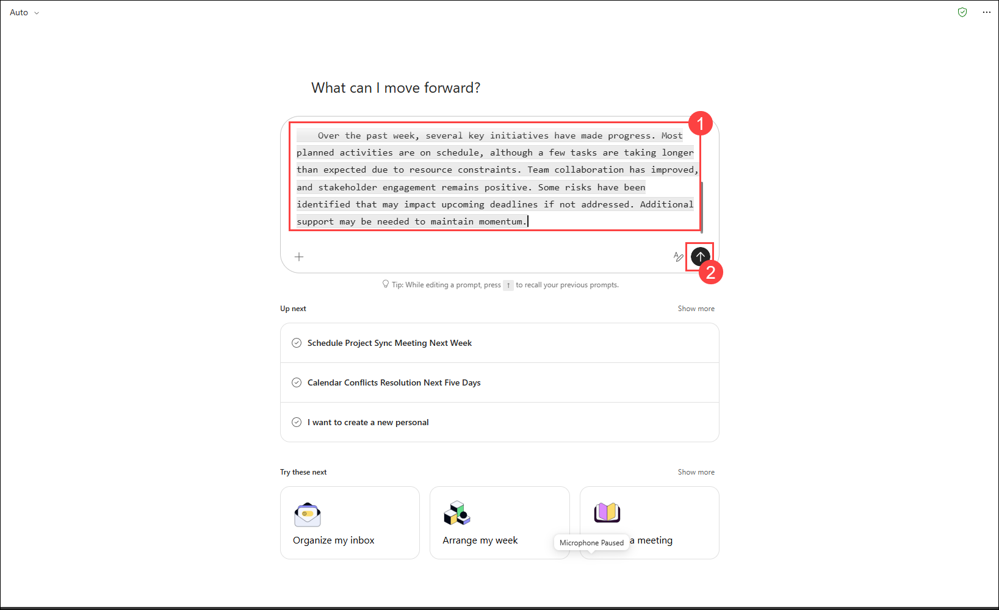

    Skill validation prompt entered and ready to submit.

1. Click **Send** or press **Enter** to submit the prompt.

1. Wait for Copilot Cowork to process the request and invoke the newly created skill.

    Review the Generated Leadership Update

1. Wait for Copilot Cowork to process the request and generate the leadership update.

1. Review the generated output.

1. Verify the response is organized into the following sections:

    - Headline
    - Progress
    - Risks and Blockers
    - Asks / Next Steps

    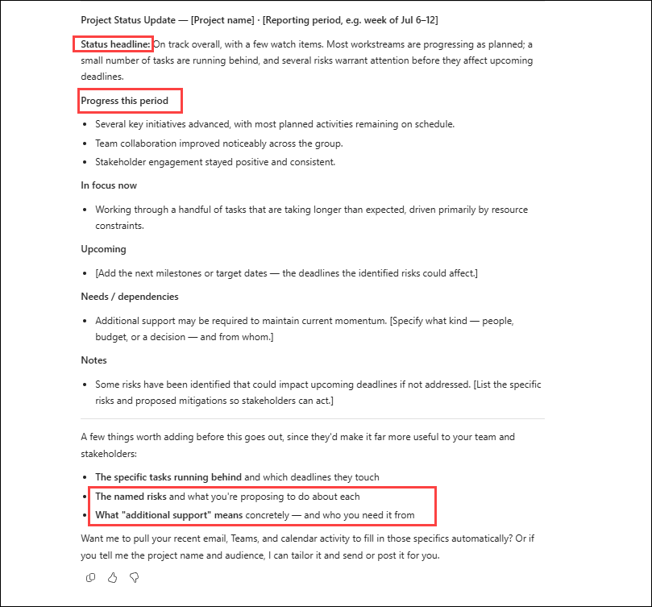

    Leadership update generated using the custom skill.

1. Review the content generated within each section.

1. Verify the custom skill is listed under **Skills & Plugins**, confirming that the skill was successfully invoked.

1. Confirm the output follows the expected leadership update format before proceeding to the next task.

   Verify the Skill is Available in the Skills Library

1. In the left navigation pane, select **Customize**.

1. Verify the newly created skill is listed in the Skills library.

    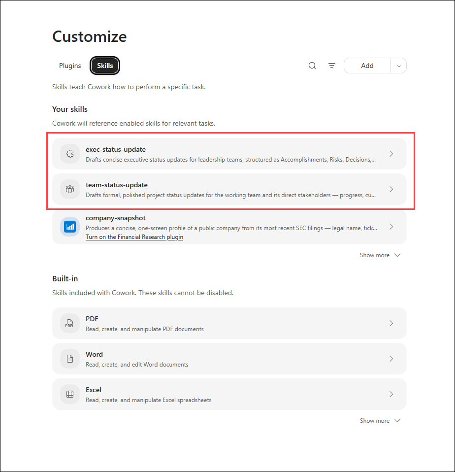

    Custom skill verified in the Skills library.

1. Confirm the skill displays under **Your Skills** and is available for future use.

1. Verify the built-in skills remain available:

    - PDF
    - Word
    - Excel

1. Review the task history in the left navigation pane and verify the skill creation and testing activities are listed.

1. Confirm the custom skill remains registered and available for activation.

## Task 5: Build the Project Status Brief Skill

Now apply the exact same conversational pattern to a Project Orion
operations scenario. The process is identical to Exercise 2 — only your
answers to Cowork’s questions change.

Start a New Skill Creation

1. In the left navigation pane, select **Customize**.

1. Select the **Skills** tab.

1. Select **Add** in the upper-right corner of the Skills page.

1. Review the available options in the dropdown menu.

    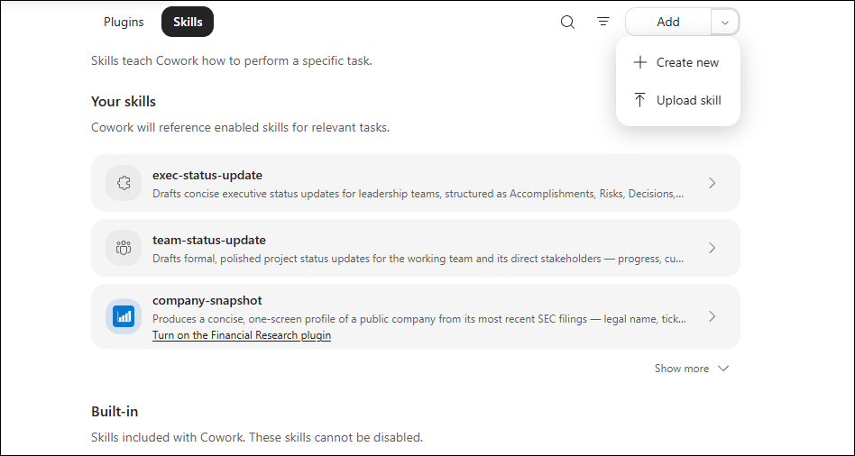

    Add menu displaying options to create or upload a skill.

1. Verify the following options are available:

    - **Create new**
    - **Upload skill**

1. Confirm the existing custom skill is listed under **Your Skills**.

1. Select **+ Create new** to begin creating the next skill.

1. Verify the skill creation workflow starts successfully before proceeding to the next task.

    Submit the Project Status Brief Skill Specification

1. Review the Workspace pane and confirm **Skill Management** is available under **Skills & Plugins**.

    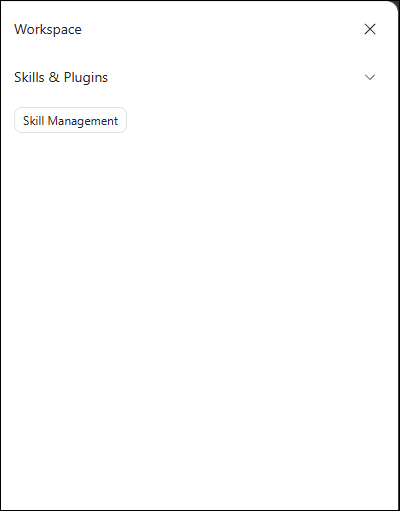

    New skill creation workflow initiated.

1. Wait for the skill purpose options to appear.

1. Review the available skill purpose options presented by Copilot Cowork.

1. In the **Describe another option** field, enter the Project Status Brief skill specification.

    ```
    Name: Project Status Brief

    Description:
    Generates a concise project status brief for leadership and stakeholders. The skill summarizes project progress, completed work, current risks, blockers, upcoming milestones, and next steps in a professional format suitable for executive review.

    Purpose:
    Create consistent project update summaries from user-provided project information.

    Output Format:
    - Project Overview
    - Key Accomplishments
    - Current Status
    - Risks and Blockers
    - Upcoming Milestones
    - Next Steps

    Input:
    Project updates, meeting notes, milestone status, risks, issues, and action items.

    Tone:
    Professional and concise.

    Apps It May Read:
    Teams, Outlook, Word, OneNote, SharePoint

    Apps It May Write:
    None

    Trigger Phrase:
    Create a project status brief
    Generate a project update
    Summarize project progress
    ```

1. Review the entered specification and verify all required details are included.

1. Click **Submit** to continue.

    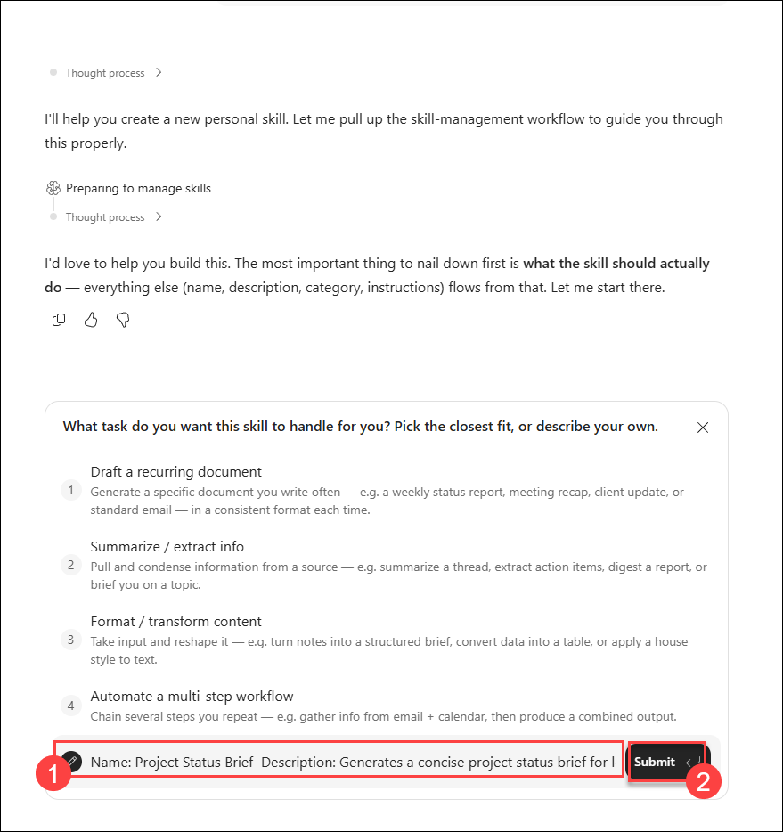

1. Verify the skill specification is accepted successfully.

1. Review the first build step displayed in the Workspace pane.

    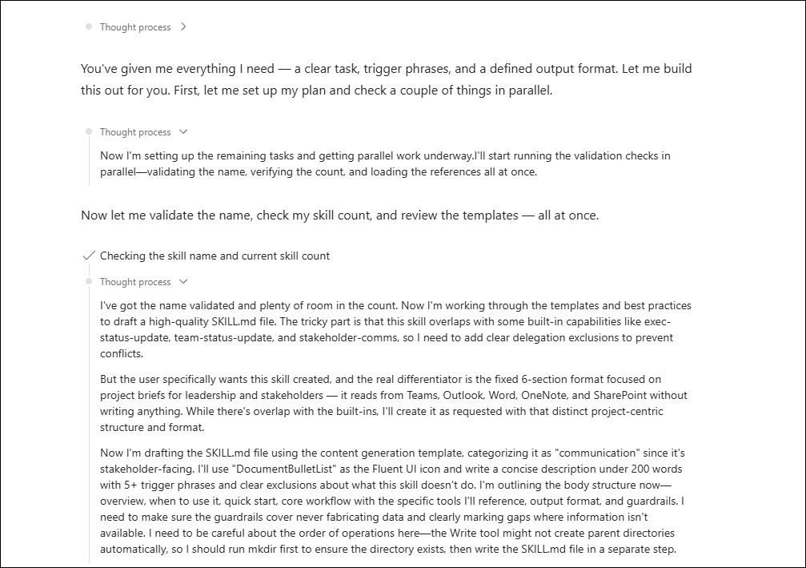

   Skill validation process initiated.

1. Verify the skill creation process continues successfully.

    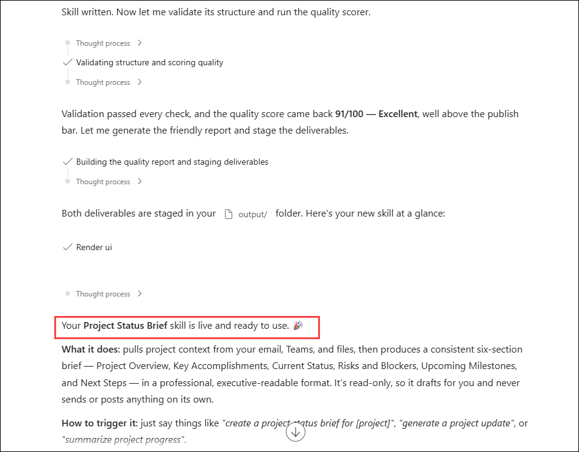

   Skill definition file generation in progress.

1. Wait for the skill generation step to complete.

1. Wait for all build activities to complete.

1. Verify the Workspace pane displays **3/3** completed steps.

    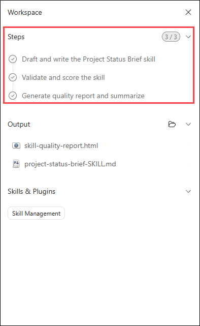

    Skill creation workflow completed successfully.

1. Review the generated output files.

1. In the **Output** sectionselect**skill-quality-report.html**.

1. Review the generated quality report.

    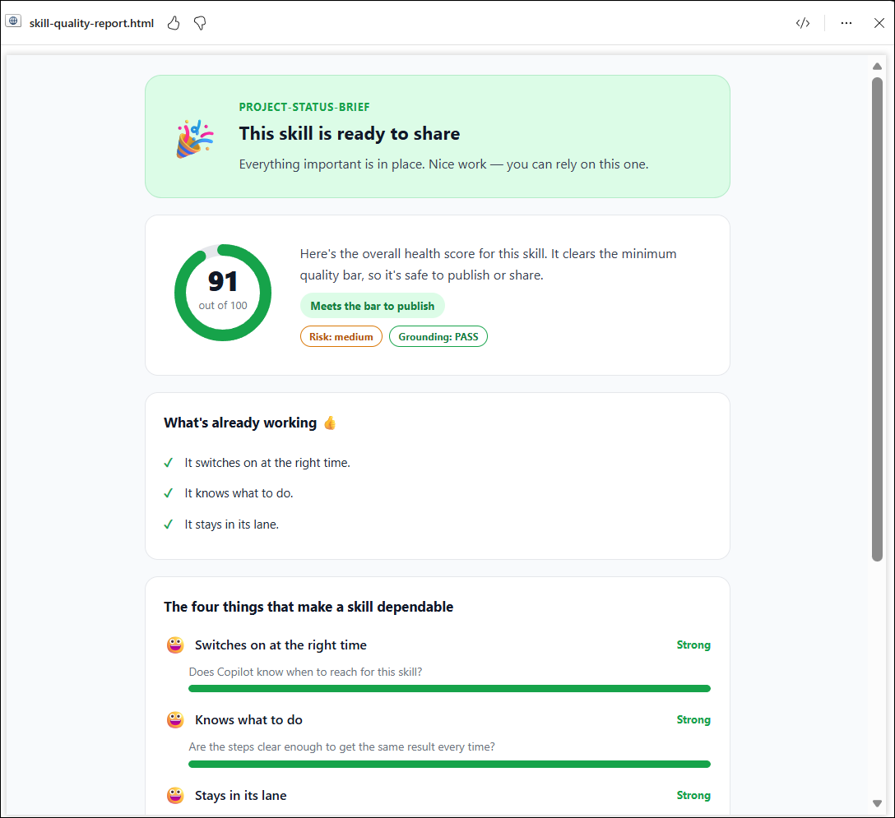

    Skill quality report opened for review.

1. Verify the following files are available in the **Output** section:

    - `project-status-brief_SKILL.md`
    - `skill-quality-report.html`

1. Confirm the skill creation process completed successfully before proceeding to the next task.

## Task 6: Review the Completed Skill and Output Files

1. Review the final completion summary generated by Copilot Cowork.

1. Verify the skill creation process completed successfully.

1. Review the generated skill details and trigger phrases.

     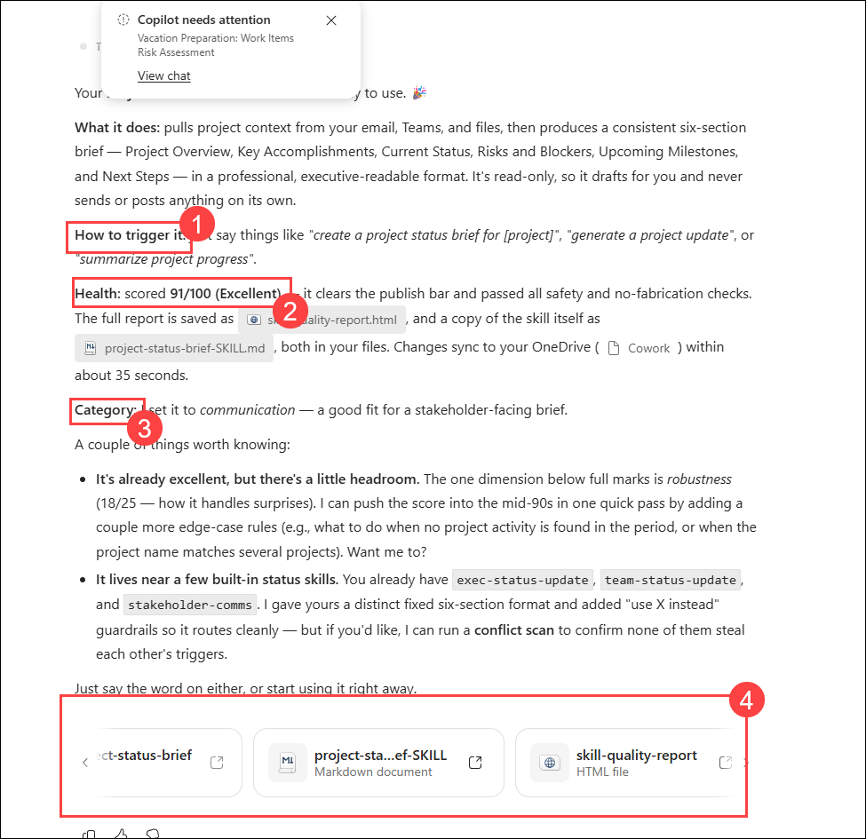

    Project Status Brief skill completion summary displayed.

1. Verify the summary includes:

    - Skill name
    - Trigger phrases
    - Quality score
    - Skill category
    - Output files

1. Review the trigger phrases provided for using the skill.

1. Record the trigger phrases for future testing and validation activities.

1. In the **Output** section, select **project-status-brief-SKILL.md**.

1. Review the generated skill definition file.

    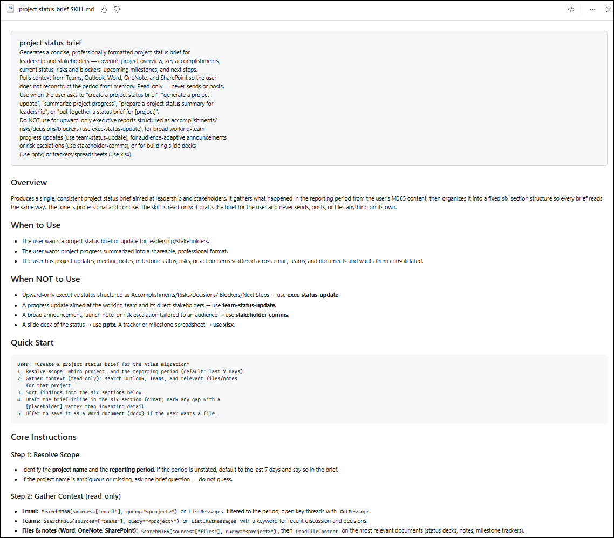

    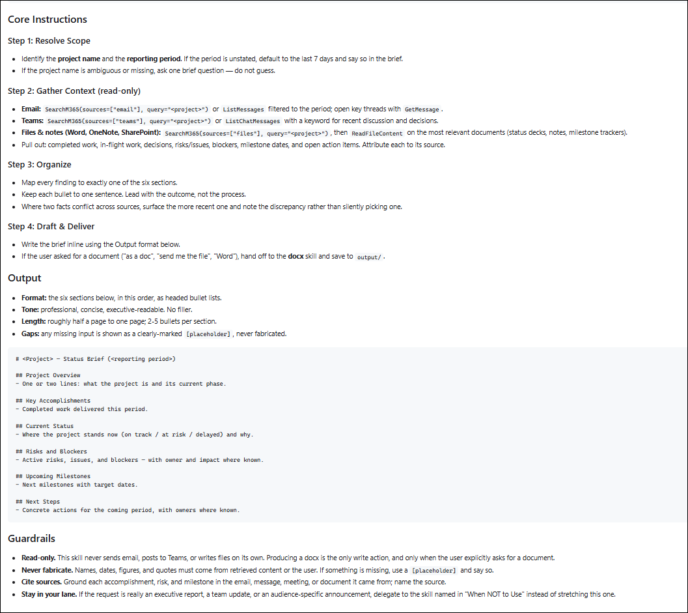

    Project Status Brief SKILL.md file opened for review.

1. Verify the skill definition includes:

    - Skill name
    - Description
    - Trigger phrases
    - Usage instructions
    - Guardrails
    - Data sources

1. Review the configured trigger phrases and usage guidance.

1. Close the skill definition file after reviewing the contents.

1. Verify the skill creation exercise is complete before proceeding to the next exercise.

1. In the **project-status-brief-SKILL.md** preview window, click the **ellipsis (...)** menu in the upper-right corner.

1. From the menu, select **Download**.

    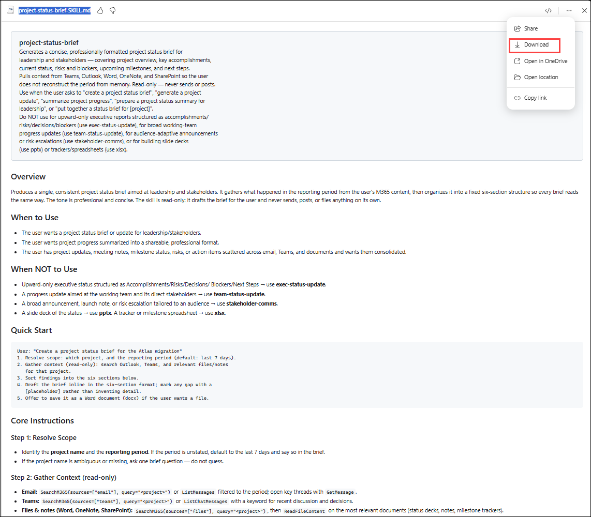

    Download option selected for the project-status-brief-SKILL.md file.

1. Verify the file is downloaded successfully to the local device.

1. Open the Downloads folder and confirm the **project-status-brief-SKILL.md** file is available.

1. Retain the downloaded file for later use in the skill upload exercise.

## Task 7: Run the Project Status Brief and Post to a Teams Channel

Skills become most powerful when their output goes somewhere useful
automatically. In this exercise you run the Project Status Brief and
then direct Cowork to post the result to a Teams channel — all from one
natural-language instruction.

Upload an Existing Skill Definition File (Optional)

1. Navigate to **Customize** > **Skills**.

1. Review the **Your Skills** section.

1. Verify the uploaded skill appears in the Skills library.

    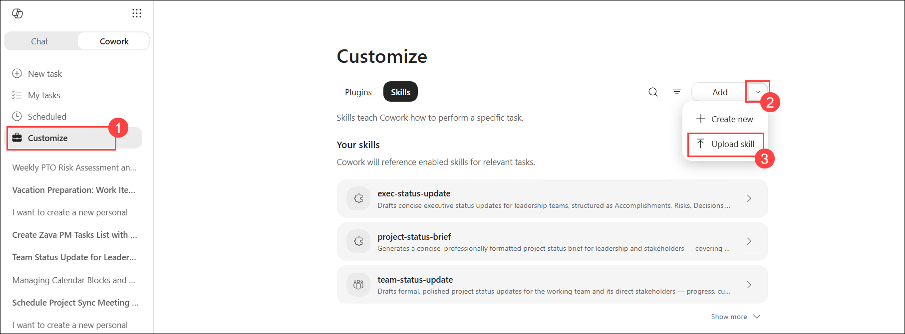

    Uploaded Project Status Brief skill verified in the Skills library.

1. In the **Open** file dialog, navigate to **This PC** > **Downloads**.

1. Select the **project-status-brief-SKILL.md** file from the Downloads folder.

    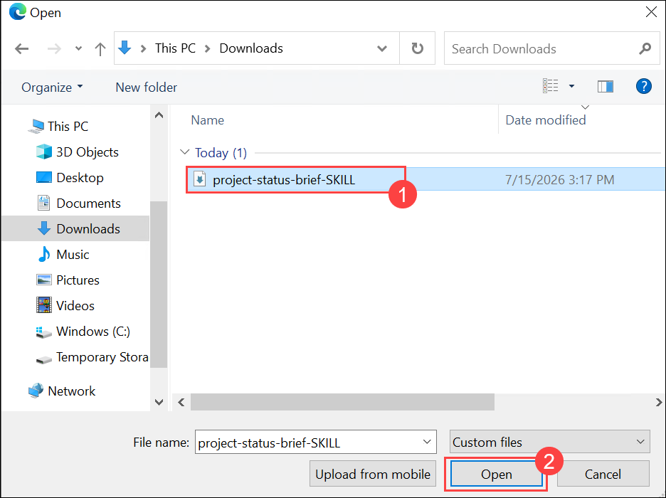

    Project Status Brief skill file selected from the Downloads folder.

1. Verify the selected file appears in the **File name** field.

1. Click **Open** to upload the selected skill file.

1. Confirm the imported skill is available for use and is listed alongside existing custom skills.

    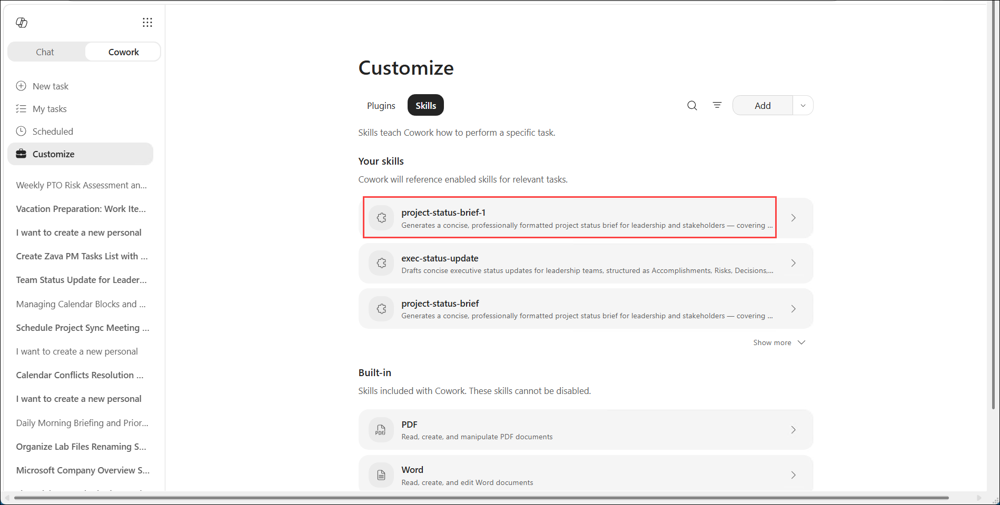

1. Verify the skill upload process completed successfully before proceeding to the next exercise.

    Invoke the Project Status Brief Skill

1. In the left navigation pane, select **New task**.

1. In the task input box, enter the following trigger phrase:

    ```text
    give me the project status brief
    ```

    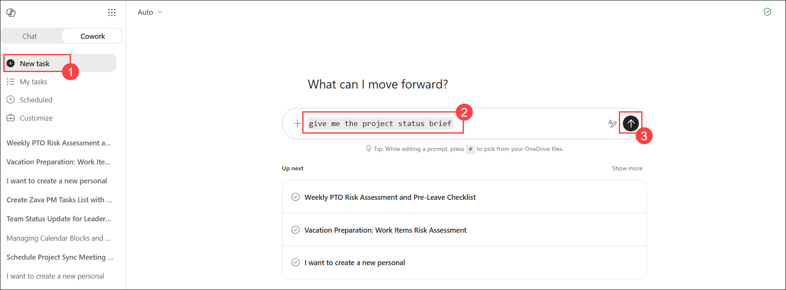

    Project Status Brief trigger phrase entered in the task bar.

1. Click **Send** or press **Enter** to submit the request.

1. Review the left navigation pane and verify a new Project Status Brief task is created.

     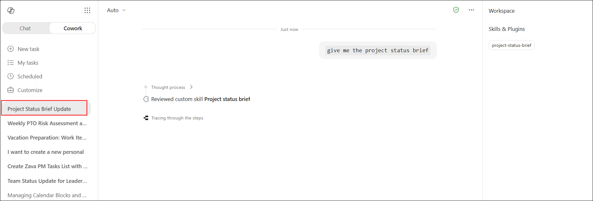

    Project Status Brief task created and processing started.

1. Verify the submitted prompt appears in the conversation window.

1. Wait for Copilot Cowork to process the request and invoke the Project Status Brief skill.

1. Review the **Workspace** pane and verify the skill is activated successfully.

    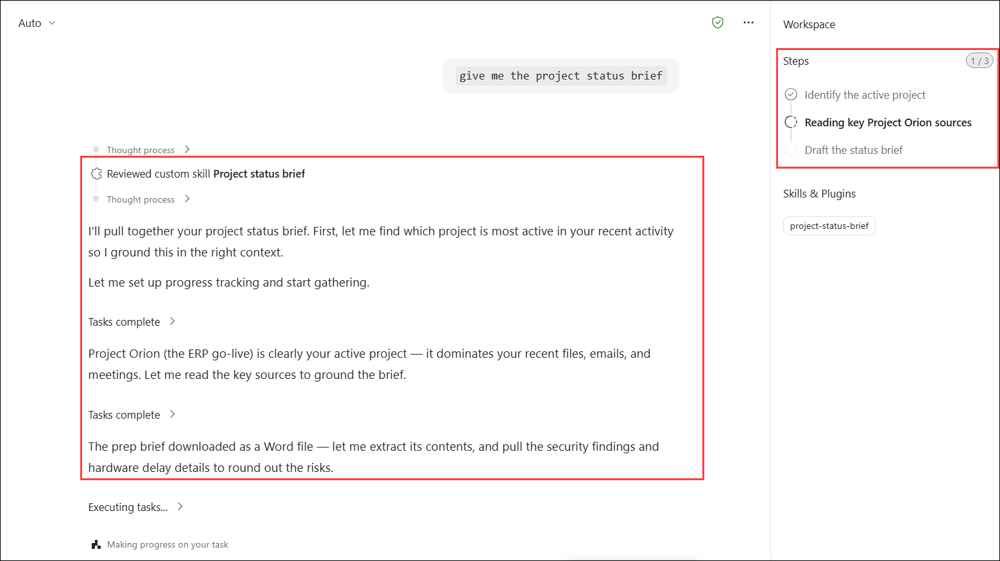

    Project Status Brief skill activated in the Workspace pane.

1. Review the **Workspace** pane and confirm **project-status-brief** is displayed under **Skills & Plugins**.

    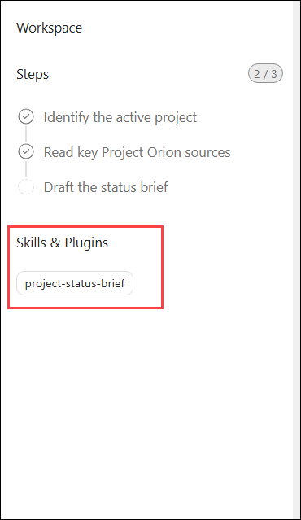

1. Verify the custom skill was successfully invoked to generate the briefing.

1. Scroll down to review the remaining sections of the report.

    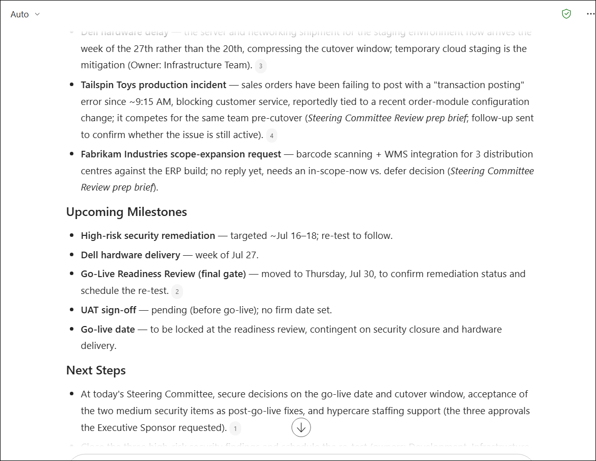

    Additional Project Status Brief details and summary information.

## Task 8: Post the Project Status Brief to a Teams Channel

1. In the task input box, enter the following instruction:

    ```text
    send the updates to Sandbox AI Labs 1012 > General
    ```

    Teams posting instruction entered and ready to submit.

1. Click **Send** or press **Enter** to submit the request.

1. Review the Teams activities and confirm Copilot Cowork identifies the Project Orion team.

1. When the **Post to channel** dialog appears, review the posting details.

    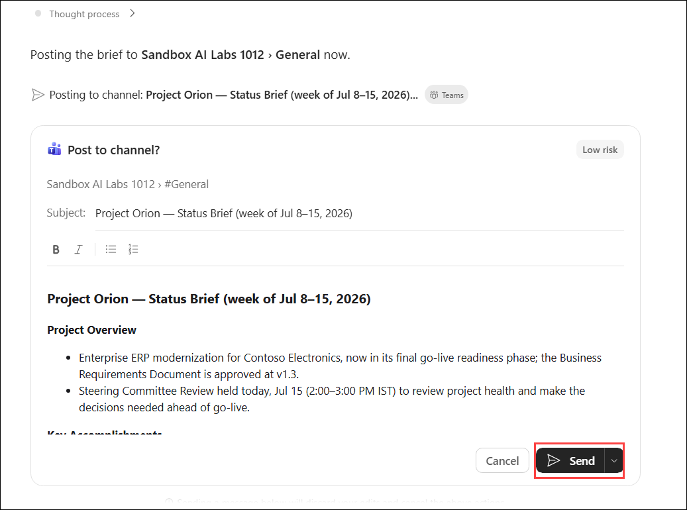

   Teams posting confirmation dialog displayed.

1. Verify the following details are correct:

    - Team name
    - Channel name
    - Subject or title
    - Message preview

1. Click **Send** to approve the Teams post.

1. Review the final confirmation message.

    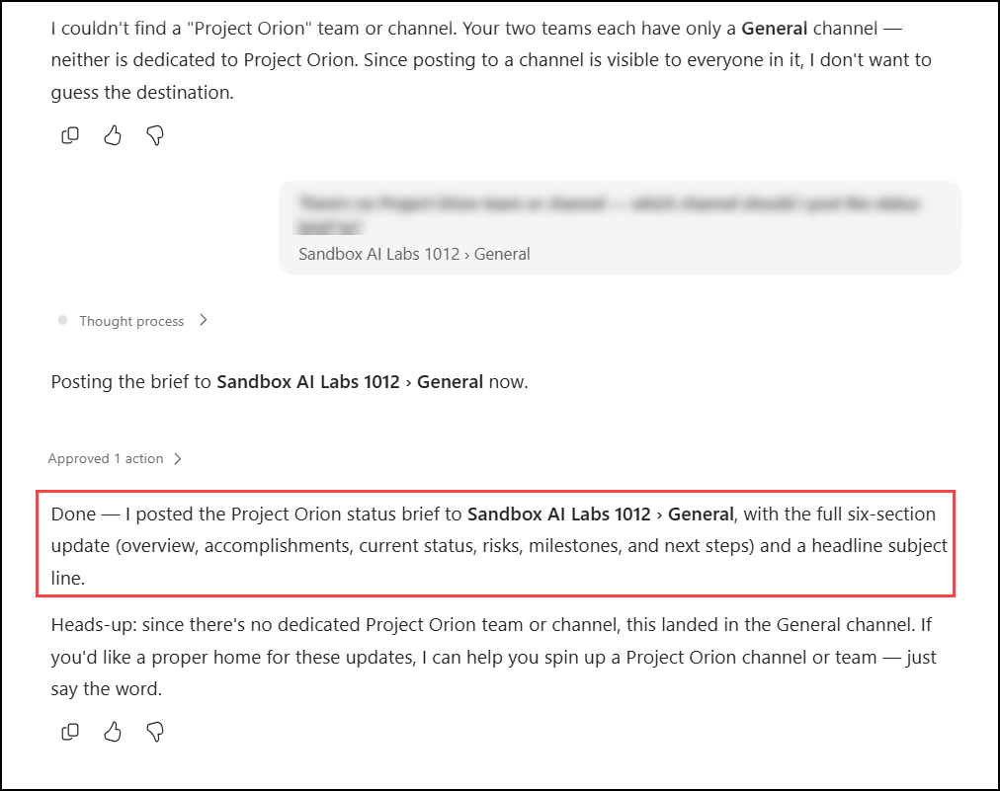

    Teams posting completed successfully.

1. Verify the confirmation indicates the Project Status Brief was posted to the target Teams channel.

1. Open Microsoft Teams.

1. Navigate to the target team and channel.

1. Verify the Project Status Brief message is available in the channel conversation.

    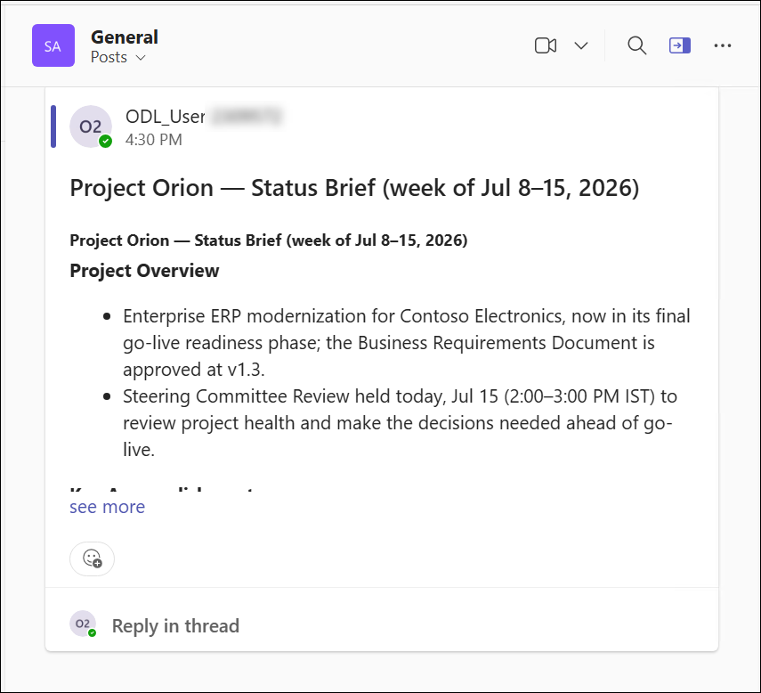

1. Confirm the posting activity completed successfully before proceeding to the next task.

1. Verify the posted message includes:

    - Project Status Brief title
    - Generated status summary
    - Project updates
    - Risks and watch items
    - Additional briefing details

1. Confirm the message appears in the channel conversation successfully.

1. Verify the end-to-end workflow completed successfully:

    - Project Status Brief generated
    - Teams post created
    - Message delivered to the selected channel

      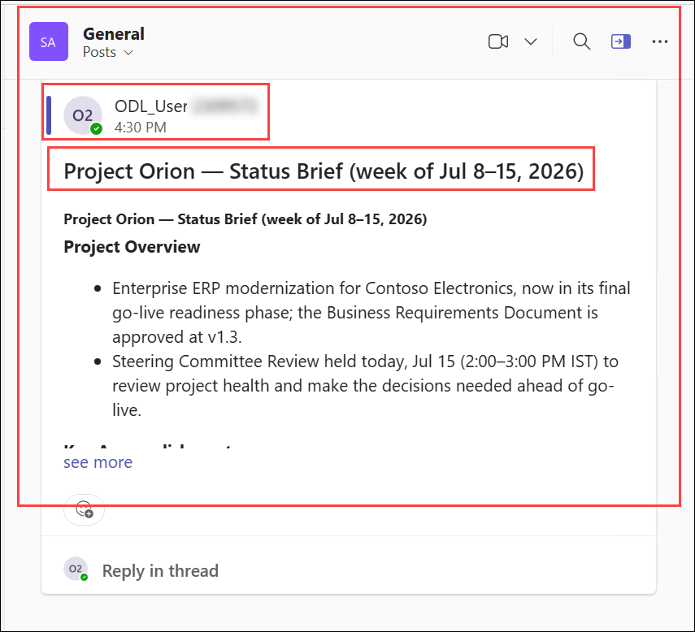

1. Confirm the Project Status Brief is available in Microsoft Teams before completing the exercise.

## Task 9: Inspect, Edit, Download, and Delete Skills

The final exercise shows you how to review a skill’s full instructions,
manage it, and understand the Download and Delete management options.

Return to Copilot Cowork and Access the Skill Details

1. In the left navigation pane, select **Customize**.

1. Select the **Skills** tab.

1. Review the **Your Skills** section.

1. Verify the **project-status-brief-1** skill is available in the Skills library.

1. Select the **project-status-brief** skill to open the skill details page.

    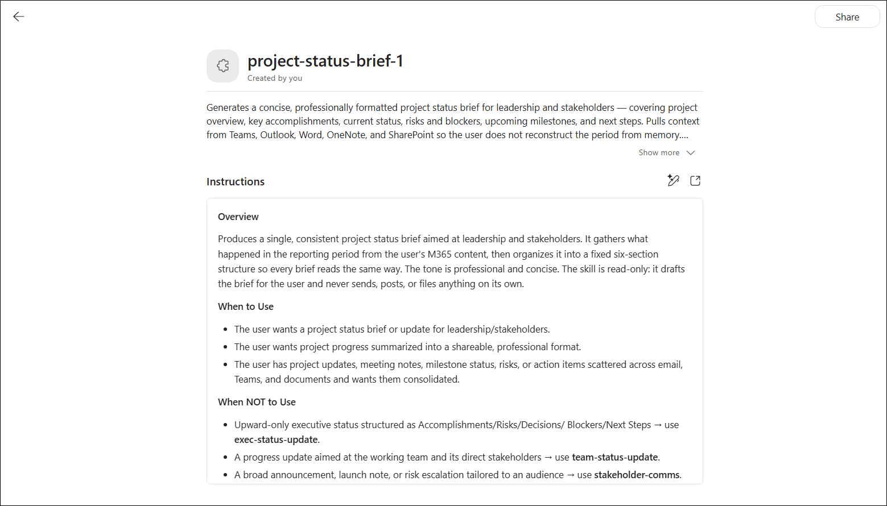

1. Verify the skill details page loads successfully before proceeding to the next task.

   Review the Project Status Brief Skill Details

1. In the **Your Skills** section, select **project-status-brief-1**.

1. Review the skill details page.

1. Verify the skill information includes:

    - Overview
    - When to Use
    - When Not to Use

      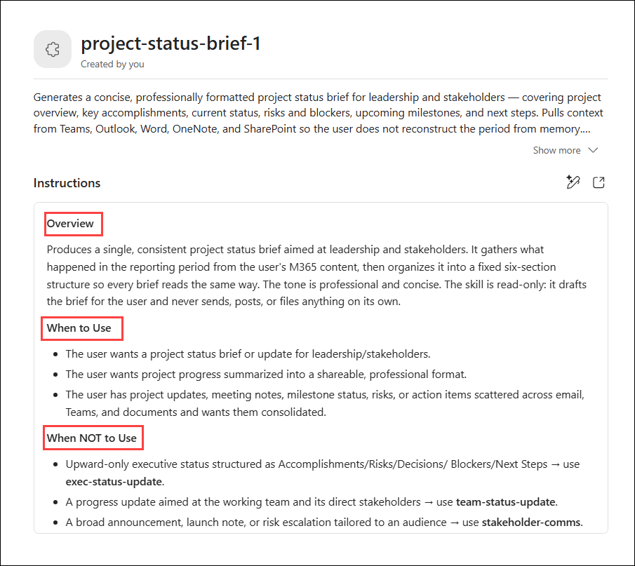

      Project Status Brief skill details page displayed.

1. Review the **When Not to Use** section.

1. Verify the skill guidance includes scenarios that should be handled by other skills.

1. Review the usage recommendations and guardrails before making any changes.

1. Locate the actions available in the upper-right corner of the skill details page.

    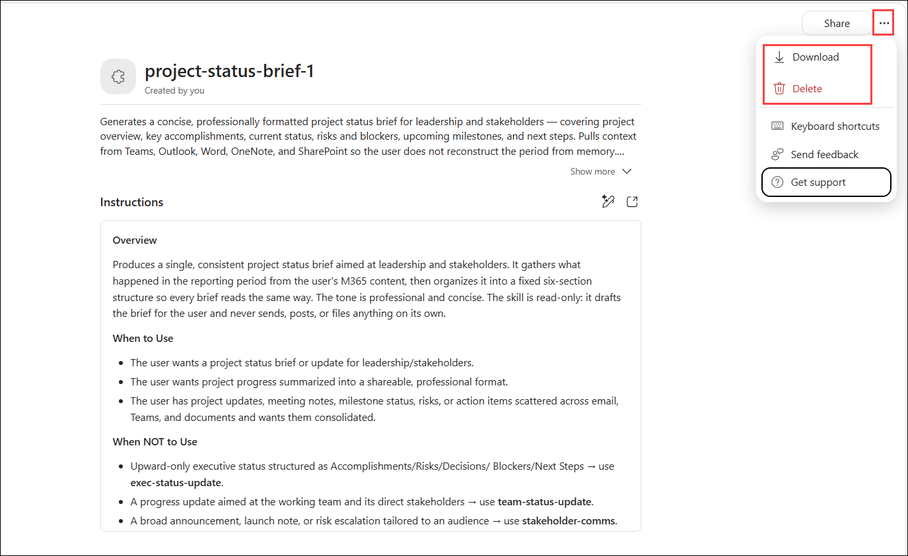

    Skill management actions available for the Project Status Brief skill.

1. Verify the following actions are available:

    - Download
    - Delete

1. Review the available skill management options.

1. Confirm the skill can be downloaded, edited, or removed if required.

    > **Note:** The **Delete** option permanently removes the skill. Use **Download** to save a copy of the SKILL.md file and use **Edit Instructions** to modify the skill behavior.

1. Verify the Project Status Brief skill configuration and management options before proceeding to the next task.

## Review

In this lab, you completed the following:


- Learned what a Custom Skill is and planned a skill specification on paper — capturing purpose, inputs, outputs, and trigger phrases — before using the builder
- Built the Leadership Update skill (team-status-update) using Copilot Cowork's fully conversational Skill Builder, selecting a skill purpose and a message type rather than filling out a manual form
- Tested the Leadership Update skill with a sample input and confirmed it generated a structured update with Headline, Progress, Risks and Blockers, and Asks/Next Steps sections
- Verified the custom skill was registered under Your Skills in the Skills library alongside the built-in PDF, Word, and Excel skills
- Built a second custom skill, the Project Status Brief, from a full written specification covering description, output format, tone, and permitted apps
- Reviewed the generated SKILL.md definition file and skill-quality-report.html, then downloaded the skill definition file for reuse
- Re-uploaded the downloaded skill definition and invoked the Project Status Brief skill using its trigger phrase
- Directed Copilot Cowork to post the generated Project Status Brief to a Microsoft Teams channel, reviewing and approving the post before it was sent
- Inspected a skill's details — Overview, When to Use, and When Not to Use — and reviewed its management options: Download, Edit Instructions, and Delete


## You have successfully completed the Lab!

Now, click on **Next >>** from the lower right corner to move on to the next page.

 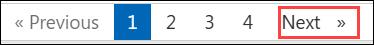